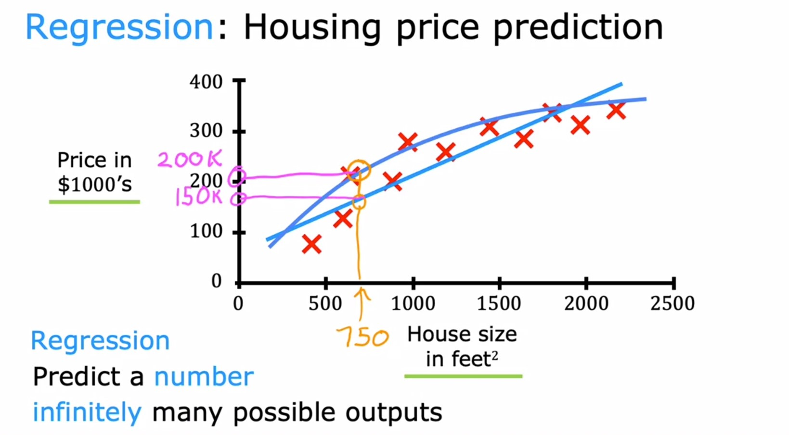
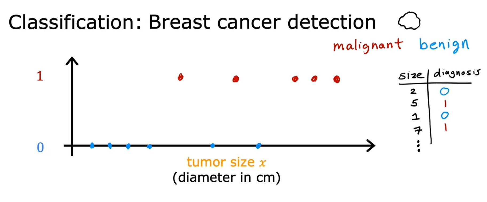
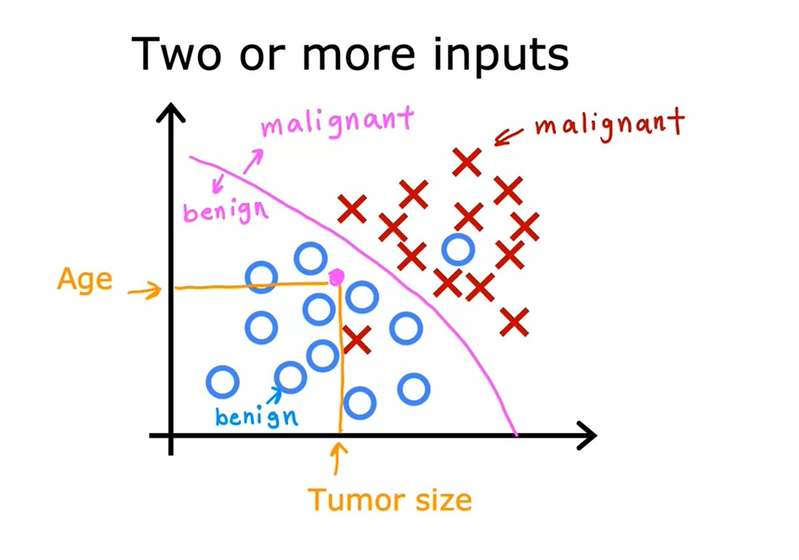
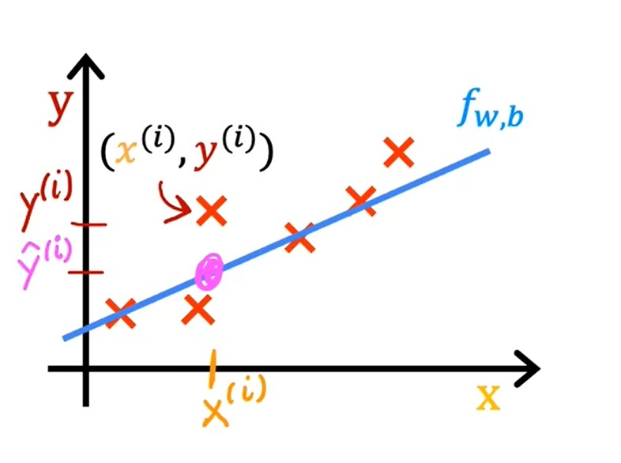
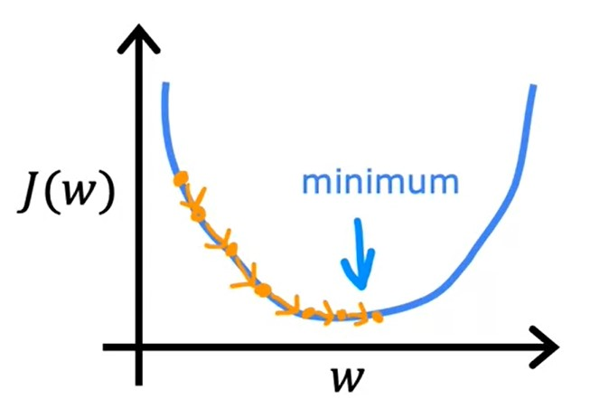
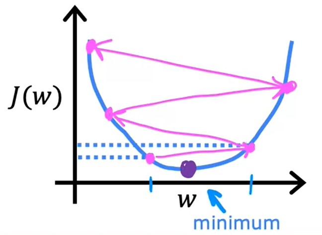
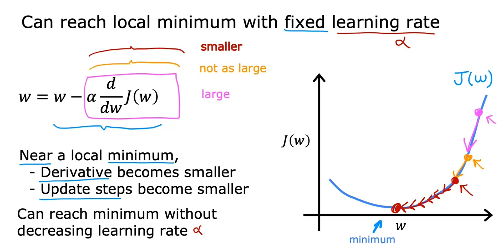

# Supervised Machine Learning: Regression and Classification
## What is machine learning?
Field of study that gives computers the ability to learn without being explicitly programmed.
### Machine Learning algorithms
* Supervised learning: 
    * Used most in real-world applications.
    * Has seen rapid advancements and innovations.
    * In this course, we will focus on this type.
* Unsupervised learning
* Recommender systems
* Reinforcement learning
## Supervised learning
* Refers to algorithms that learn `x` to `y` or `input` to `output` mappings.  
* The key characteristics of supervised learning is that you give your learning algorithm examples to learn from that includes the `right answers`.  
* By seeing correct pairs of `input x` and desired `label y`, the learning algorithm eventually learns to take the input alone without the output label and gives a reasonably accurate prediction or guess of the output.
### Examples
Input (X) | Output(Y) | Application
----------|-----------|------------
email | spam?(0/1) | spam filtering
audio | text transcripts | speech recognition
English | Spanish machine | translation
ad, user info | click?(0/1) | online advertising
image, radar info | position of other cars | self-driving car
image of phone | defect?(0/1) | visual inspection

### Regression
**Regression** is a special type of Supervised Learning which predicts a **number** from infinitely many possible outputs.
#### Regression: Housing price prediction

* Here we gather data about houses and plot their size against their prices.
* Then we try to fit a line or a curve (based on a more complicated function) to the data point.
* Then we can predict the price of a house with size not in our training dataset.

### Classification
* In **Classification**, the algorithm tries use the input to predict the output _class_ or _category_ out of small number of possible classes/categories.
    * This is different from [Regression](#regression) which tries to predict any number of infinitely many possible numbers.

* In Classification, the terms output **Class** or **Category** are often used interchangeably.
* Classification algorithms predict categories.
* Categories don't have to be numbers.

#### Example
When ploting the data of breast cancer (_Age_ & _Tumor size_ vs _Tumor Type_)

* We use circles to represent patients with benign tumor and corsses to represent patients with malignant tumor.
* So when a new patient comes in, the doctor measures the tumor size and record the age.
* Given a dataset like this, the learning algorithm tries to find some boundry that seperates the malignant tumors from the benign ones. So the learning algorithm has to decide how to fit a boundry line between that classify the data.

## Unsupervised learning
* Unsupervised learning deals with data that is NOT associated with any output label `y`.
    * Data only comes with inputs `X`, but not output labels `Y`.
* Unsupervised learning is used to find any structure, pattern or something interesting in the data.
    * Algorithm has to find **structure/pattern** in the data.
* We call it **Unsupervised learning** because we're not trying to supervise the algorithm to give some **right answer** for every input.
* Instead, we are asking the algorithm to figure out all by itself what's interesting or what pattern, structure that might be in this data.
* Some types of Unsupervised learning algorithms:
    * [**Clustering**](#clustering): Group similar data points together.
    * **Anomaly detection**: which is used to detect unusual data points. This is useful for Fraud detection and many other applications.
    * **Dimensionality reduction**: Compress data using fewer numbers while losing as little information as possible.
### Clustering
* This is a type of [Unsupervised learning](#unsupervised-learning).
* It places the unlabeled data into different clusters.
* Clustering is used in many applications. As examples:
    * [Google News](https://news.google.com/): It goes through hudereds of thousands of news articles on the internet and groups related stories together.
    * [DNA microarray](https://en.wikipedia.org/wiki/DNA_microarray)
    * Grouping customers
## Regression Model
### Terminology
* **Training Set**: Data used to train the model.
    * Notation:
   $$
   \begin{split}
   x = & \text{ "input" variable} \\
   & \text{ "feature" variable} \\
   y = & \text{ "output" variable} \\
   & \text{ "target" variable} \\
   m = & \text{ number of training examples} \\
   (x, y) = & \text{ single training example} \\
   (x^{(i)}, y^{(i)}) = & i^{th} \text{ training example} \\
   & (1^{\text{st}}, 2^{\text{nd}}, 3^{\text{rd}} \dots)
   \end{split}
   $$

* **Training set** in Supervised Learning includes both
    * Input **features**.
    * Output **targets**.
* To train the model you feed the **Training set** (**features** and **targets**) to you the **Supervised Learnig Algorithm**.
* The **Supervised Learnig Algorithm** will produce some **function** $f$. Historically it used to be called _hypothesis_ but will stick to calling it a **function**.
* Function $f$ then takes new input $x$ and output and _estimate_ or _prdiction_ which we call it $\hat{y} \quad \text{"y-hat"}$.
* $\hat{y}$ is the estimate or prediction for $y$.
* Function $f$ is called the **model**.
* When using symbol $y$, this refers to the **target** which is the actual true value in the training set.
* $\hat{y}$ refers to the estimate. It may or may not be the actual true value.
### How to represent $f$ ?
* Assuming $f$ is a straight line, so our function can be written as:

$$
f_{w,b}(x) = wx + b \qquad \text{Where } w \text{ and } b \text{ are numbers}
$$

* The values of $w$ and $b$ will determine the prediction $\hat{y}$ based on the input feature $x$.
* The expression $f(x) = wx + b$ is a linear function so the training algorithm is trying to fit a line to our data.
* In more complex scenario, we might want to fit a curve (non-linear function).
* Linear algorithm that generates a linear function is called **Linear Regression** with one variable.
* Expression $f(x) = wx + b$ is Linear Regression with **one variable**.
    * **One variable** means that there's a single input variable or feature $x$.
    * One input varibale also can be called **Univariate** linear regression.

[JupyterLab example](./code/C1_W1_Lab02_Model_Representation_Soln.ipynb)

## Cost Function
* In order to implement [Linear Regression](#regression-model), the first key step is to define **Cost Function**.
* The **Cost Function** will tell us how well the model is doing.
* Consider we have a training set (**features** and **targets**) so the Linear Regression model will be:

$$
\begin{split}
\text{Model: } f_{w,b} = wx + b \\
w,b: & \text{parameters} \\
& \text{coefficients} \\
& \text{weights}
\end{split}
$$

* In machine learning, **parameters** of the model are the variables you can adjust during training in order to improve the model.
* Sometimes **parameters** $w$ and $b$ are referred to as **coefficients** or **weights**.
* With Linear Regression, we want to choose values for the parameters $w$ and $b$ so the straight line you get from the function $f$ somehow fits the data well.  

$$
\begin{split}
\hat{y}^{(i)} & = f_{w,b}\left(x^{(i)}\right) \\
f_{w,b}\left(x^{(i)}\right) & = wx^{(i)} + b
\end{split}
$$

* The objective is to find $w,b$ so that $\hat{y}^{(i)}$ is close to $y^{(i)}$ for all $\left(x^{(i)}, y^{(i)}\right)$.
    * We first need to measure how well a line fits the training data.
    * So we need to construct a **Cost Function**.
    * Below is the formula of **Cost Function**: squared error cost function.

$$
\begin{split}
J(w,b) & = \frac{1}{2m} \sum\limits_{i=1}^{m}\left(\underbrace{\hat{y}^{(i)} - y^{(i)}}_\text{error} \right)^{2} \\
& m = \text{number of training examples} \\
J(w,b) & = \frac{1}{2m} \sum\limits_{i=1}^{m} \left(f_{w,b} \left(x^{(i)}\right) - y^{(i)}\right)^{2}
\end{split}
$$

* In machine learning, different people will use different cost functions for different applications.
* Squared error cost function is by far the most commonly used one for linear regression and also all regression problems.
* Eventually we want to find values of $w$ and $b$ that makes the cost function small.

$$
\min_{w,b} J(w,b)
$$

[JupyterLab example](./code/C1_W1_Lab03_Cost_function_Soln.ipynb)

## Gradient descent
* **Gradient descent** is an algorithm that can be used to find the values of $w$ and $b$ that results in the smallest possible cost $\min_{w,b} J(w,b)$.
* **Gradient descent** is used all over machine learning not just for linear regression (for example in Deep Learning models)
### Gradient descent algorithm 
$$
\left.\begin{aligned}
w = w - \alpha \frac{\partial}{\partial{w}}J(w,b) \\
b = b - \alpha \frac{\partial}{\partial{b}}J(w,b) 
\end{aligned}
\right \rbrace
\qquad w\text{ and }b\text{ must be updated simultaneously}
$$

* $\alpha$ is the learning rate. 
    * It is usually a small positive number between $0$ and $1$ (_i.e._ $0.01$)
    * What $alpha$ does is basically controls how big of a step you take downhill on the function graph.
    * If $\alpha$ is very large, then this corresponds to a very aggressive gradient descent procedure. 
* $\frac{\partial}{\partial{w}}J(w,b)$ is the derivative term of the cost function $J$
    * In combination with the learning rate $\alpha$ it determine the size of the steps.
* **Important Note**: Gradient descent can find local minimum instead of global minimum.

## Learning rate
The choice of the learning rate $\alpha$ will have a huge impact on the efficiency of your implementation of gradient descent. And if alpha, the learning rate is chosen poorly rate of descent may not even work at all.  

  
If $\alpha$ is too **small**:
* Gradient descent may be **slow**.

  
If $\alpha$ is too **large**, Gradient descent may be:
* **Overshoot, never reach minimum**.
* Fail to converge, diverge.

## Gradient descent for linear regression
We will use the Squared error cost function for the linear regression with gradient descent.
* Linear regression model

$$
f_{w,b}(x) = wx + b
$$

* Cost function 

$$
J(w,b) = \frac{1}{2m} \sum\limits_{i=1}^{m}{\left(f_{w,b}\left(x^{(i)}\right) - y^{(i)}\right)^{2}}
$$

* Gradient descent algorithm

$$
\begin{split}
\text{repeat until convergence } & \{ \\
w & = w - \alpha \frac{\partial}{\partial{w}} J(w,b) \\
b & = b - \alpha \frac{\partial}{\partial{b}} J(w,b) \\
\}
\end{split}
$$

* To calculate the dervitaves $\frac{\partial}{\partial{w}} J(w,b)$ and $\frac{\partial}{\partial{b}} J(w,b)$:

$$
\begin{split}
\frac{\partial}{\partial{w}} J(w,b) & = \frac{\partial}{\partial{w}} \frac{1}{2m} \sum\limits_{i=1}^{m}{\left(f_{w,b}\left(x^{(i)}\right) - y^{(i)}\right)^{2}} \\
& = \frac{\partial}{\partial{w}} \frac{1}{2m} \sum\limits_{i=1}^{m}{\left(wx^{(i)} + b - y^{(i)}\right)^{2}} \\
& = \frac{\partial}{\partial{w}} \frac{1}{\cancel{2}m} \sum\limits_{i=1}^{m}{\left(wx^{(i)} + b - y^{(i)}\right)} \cancel{2}x^{(i)} \\
\end{split}
$$

$$
\boxed{\frac{\partial}{\partial{w}} J(w,b) = \frac{\partial}{\partial{w}} \frac{1}{m} \sum\limits_{i=1}^{m}{\left(wx^{(i)} + b - y^{(i)}\right)} x^{(i)}}
$$

$$
\begin{split}
\frac{\partial}{\partial{b}} J(w,b) & = \frac{\partial}{\partial{b}} \frac{1}{2m} \sum\limits_{i=1}^{m}{\left(f_{w,b}\left(x^{(i)}\right) - y^{(i)}\right)^{2}} \\
& = \frac{\partial}{\partial{b}} \frac{1}{2m} \sum\limits_{i=1}^{m}{\left(wx^{(i)} + b - y^{(i)}\right)^{2}} \\
& = \frac{\partial}{\partial{b}} \frac{1}{\cancel{2}m} \sum\limits_{i=1}^{m}{\left(wx^{(i)} + b - y^{(i)}\right)} \cancel{2}
\end{split}
$$

$$
\boxed{\frac{\partial}{\partial{b}} J(w,b) = \frac{\partial}{\partial{b}} \frac{1}{m} \sum\limits_{i=1}^{m}{\left(wx^{(i)} + b - y^{(i)}\right)}}
$$

* When using the Squared error cost function with Linear Regression we have only one minimum which is a global minimum because the cost function is convex function.

* **Batch** gradient descent: **Batch** means that each step of gradient descent uses **all the training examples**.

[JupyterLab example](./code/C1_W1_Lab04_Gradient_Descent_Soln.ipynb)