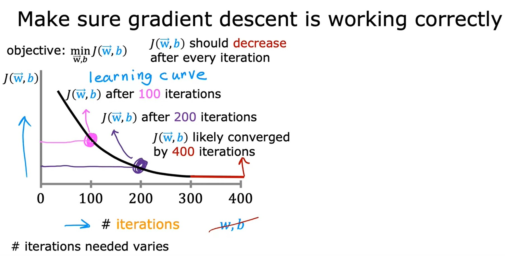

# Week 2: Regression with multiple input variables
## Multiple Linea regression
### Multiple features
Consider the housing problem with more than one features.
Size in Feets <br> $\mathbf{x}_{1}$ | Number of bedrooms <br> $\mathbf{x}_{2}$ | Number of floors <br> $\mathbf{x}_{3}$ | Age of home in years <br> $\mathbf{x}_{4}$ | Price (\$) in \$1000's
--------------|--------------------|------------------|----------------------|-----------------------
2014 | 5 | 1 | 45 | 460
1416 | 3 | 2 | 40 | 232
1534 | 3 | 2 | 30 | 315
852 | 2 | 1 | 36 | 178

* Notations

$$
\begin{split}
\mathbf{x}_{j} & = j^{th} \text{ feature} \newline
n & = \text{number of features} \newline
\vec{\mathbf{x}}^{(i)} & = \text{features vector of } i^{th} \text{ training data} \quad  \xrightarrow{\text{example}} \quad \vec{\mathbf{x}}^{(2)} = \begin{bmatrix} 1416 & 3 & 2 & 40 \end{bmatrix} \newline
\mathbf{x}^{(i)}_{j} & = \text{Value of feature } j \text{ in } i^{th} \text{ training example} \quad  \xrightarrow{\text{example}} \quad \mathbf{x}^{(2)}_{3} = 2
\end{split}
$$

#### Multiple Linear regression model using $n$ features  
* Parameters of the model are:

$$
\begin{split}
\vec{\mathbf{w}} & = \begin{bmatrix} w_{1} & w_{2} & w_{3} & \cdots & w_{n} \end{bmatrix} \newline
b & \text{ is a number} \newline
\vec{\mathbf{x}} & = \begin{bmatrix} \mathbf{x}_{1} & \mathbf{x}_{2} & \mathbf{x}_{3} & \cdots & \mathbf{x}_{n} \end{bmatrix} \newline
\end{split}
$$

* So the **Multiple Linear regression model** would be:

$$
\begin{split}
f_{\vec{w},b}(\vec{\mathbf{x}}) & = \vec{\mathbf{w}} \underbrace{\cdot}_{\text{dot product}} \vec{\mathbf{x}} + b \newline
& = w_{1}\mathbf{x}_{1} + w_{2}\mathbf{x}_{2} + w_{3}\mathbf{x}_{3} + \cdots + w_{n}\mathbf{x}_{n} + b
\end{split}
$$

### Vectorization
When using Vectorization when writing your machine learning code, it makes your program shorter and also run more effeciently.
### Vectorization example
$$
\text{Parameters and features:} \newline
\vec{\mathbf{w}} = \begin{bmatrix} w_{1} & w_{2} & w_{3} \end{bmatrix} \newline
b \text{ is a number} \newline
\vec{\mathbf{x}} = \begin{bmatrix} \mathbf{x}_{1} & \mathbf{x}_{2} & \mathbf{x}_{3} \end{bmatrix} \newline
n = 3
$$

In Python we are going to define vectors $\vec{\mathbf{w}}$ and $\vec{\mathbf{x}}$ as Arrays of Linear Algebra library [NumPy](https://numpy.org/):
```python
w = np.array([1.0, 2.5, -3.3])
b = 4
x = np.array([10,20,30])
```

##### Without Vectorization 
We can implement the model (for small $n$) as:  

$$
f_{\vec{w},b}(\vec{\mathbf{x}}) = \mathbf{w}_{1}\mathbf{x}_{1} + \mathbf{w}_{2}\mathbf{x}_{2} + \mathbf{w}_{3}\mathbf{x}_{3} + b
$$

```python
f = w[0] * x[0] + 
    w[1] * x[1] + 
    w[2] * x[2] + b
```

For Large $n$, we can implemet:

$$
f_{\vec{w},b}(\vec{\mathbf{x}}) = \left( \sum\limits_{j=1}^{n}{w_{j}x_{j}} \right) + b
$$

```python
f = 0 
for j in range(0, n):
    f = f + w[j] * x[j]
f = f + b
```

##### Using Vectorization

$$
f_{\vec{w},b}(\vec{\mathbf{x}}) = \vec{\mathbf{w}} \cdot \vec{\mathbf{x}} + b
$$

This vectorized implementation using NumPy will run much faster because it will utilize parallel computation.

```python
f = np.dot(w, x) + b
```

[JupyterLab Example](./code/C1_W2_Lab01_Python_Numpy_Vectorization_Soln.ipynb)


### Gradient descent for multiple linear regression
The notations of Gradient descent for multiple linear regression will be:
* Parameters:

$$
\vec{\mathbf{w}} = \begin{bmatrix} w_{1} & \cdots & w_{n} \end{bmatrix} \newline
b \text{ is a number} 
$$

* Model:

$$
f_{\vec{w},b}(\vec{\mathbf{x}}) = \vec{\mathbf{w}} \cdot \vec{\mathbf{x}} + b
$$

* Cost function:

$$
J(\vec{\mathbf{w}}, b)
$$

* Gradient descent algorithm:

$$
\begin{align*} 
\text{repeat}&\text{ until convergence:} \; \lbrace \newline
\;  w_{j} &= w_{j} -  \alpha \frac{\partial}{\partial w_{j}} J(\vec{\mathbf{w}},b)   \; \newline 
& = w_{j} -  \alpha \frac{1}{m} \sum\limits_{i=1}^{m}\left(f_{\vec{w},b}\left(\vec{\mathbf{x}}^{(i)}\right) - y^{(i)}\right)x_{j}^{(i)} \newline
 b &= b -  \alpha \frac{\partial}{\partial b}  J(\vec{\mathbf{w}},b) \newline
& = b - \alpha \frac{1}{m} \sum\limits_{i=1}^{m}\left(f_{\vec{w},b}\left(\vec{\mathbf{x}}^{(i)}\right) - y^{(i)}\right) \newline
\rbrace
\end{align*}
$$

[JupyterLab Example](./code/C1_W2_Lab02_Multiple_Variable_Soln.ipynb)

### An alternative to gradient descent
An alternative to gradient descent is a method called **Normal Equation**
* Works only for Linear Regression
* Solve for $w$, $b$ without iterations useing advanced Linear Algebra techniques.
* It may be used in some machine learning libraries that implement the Linear Regression.
* Gradient descent is the recommended method for finding parameters $w$, $b$.

Disadvantages:
* Doesn't generalize to other learning algorithms.
* Slow when the number of features is large (>10,000)

## Gradient descent in practice
### Feature scaling
* **Feature scaling** convert features of different ranges of values into comparable ranges of values.
* Gradient descent is much faster with scaled features.
### Feature Scaling methods
#### Divide by maximum
Divide each value of feature $x$ by the maximum value in the range of $x$ values

$$
\text{If } 300 \leq x_{1} \leq 2000 \quad \text{Then:} \newline
x_{1,scaled} = \frac{x}{\underbrace{2000}_\text{max}} \newline
\implies 0.15 \leq x_{1,scaled} \leq 1
$$

#### Mean normalization
Use the average of the features values $\mu$

$$
\begin{split}
\text{If } 300 & \leq x_{1} \leq 2000 \quad \text{Then:} \newline
x_{1,scaled} & = \frac{x_{1} - \mu_{1}}{x_{max} - x_{min}} \newline
& = \frac{x_{1} - \mu_{1}}{2000 - 300} \newline
\implies & -0.18 \leq x_{1} \leq 0.82
\end{split}
$$

#### Z-score normalization
We need to calculate the standard deviation of each feature $\sigma$ and the mean $\mu$

$$
\begin{split}
\text{If } 300 \leq & x_{1} \leq 2000 \quad \text{ and } \mu_{1} = 600, \sigma_{1} = 450 \text{ Then:} \newline
x_{1,scaled} & = \frac{x_{1} - \mu_{1}}{\sigma_{1}} \newline
\implies & -0.67 \leq x_{1} \leq 3.1
\end{split}
$$

### Feature scaling considerations
* Aim -loosely- for about $-1 \leq x_{j} \leq 1$ for each feature $x_{j}$

$$
-3 \leq x_{j} \leq 3 \implies \text{Acceptable range} \newline
-0.3 \leq x_{j} \leq 0.3 \implies \text{Acceptable range} \newline
0 \leq x_{j} \leq 3 \implies \text{OK, no rescaling needed} \newline
-2 \leq x_{j} \leq 0.5 \implies \text{OK, no rescaling needed} \newline
-100 \leq x_{j} \leq 100 \implies \text{Too large ... rescaling needed} \newline
-0.001 \leq x_{j} \leq 0.001 \implies \text{Too small ... rescaling needed} \newline
98.5 \leq x_{j} \leq 105 \implies \text{Too large ... rescaling needed} \newline
$$

### Checking gradient descent for convergence
* Make sure that gradient descent is working well.
* The objective of gradient descent is:

$$
\text{Objective:  } \min_{\vec{w},b}{J(\vec{w},b)}
$$



* Plot the cost function $J(\vec{w},b)$ against the **# iterations** which is a type of graphs used in Machine Learning called **Learning Curve**.
    * $J(\vec{w},b)$ should be decreasing after every iteration.
    * If the value of $J(\vec{w},b)$ is ever increasing after one iteration, this can be because:
        * Learning rate $\alpha$ is choosen poorly which means $\alpha$ is too large.
        * It could be bug in the code.
    * \# iteration needed varies between applications.
* It is possible to create **Automatic convergence test**
    * Let $\epsilon$ **epsilon** be a small number, for example $10^{-3}$
    * If $J(\vec{w},b)$ descreases by $\leq \epsilon$ in one iteration, declare **convergence**.

[<<Previous](../week-01/README.md) | [Next>>]()