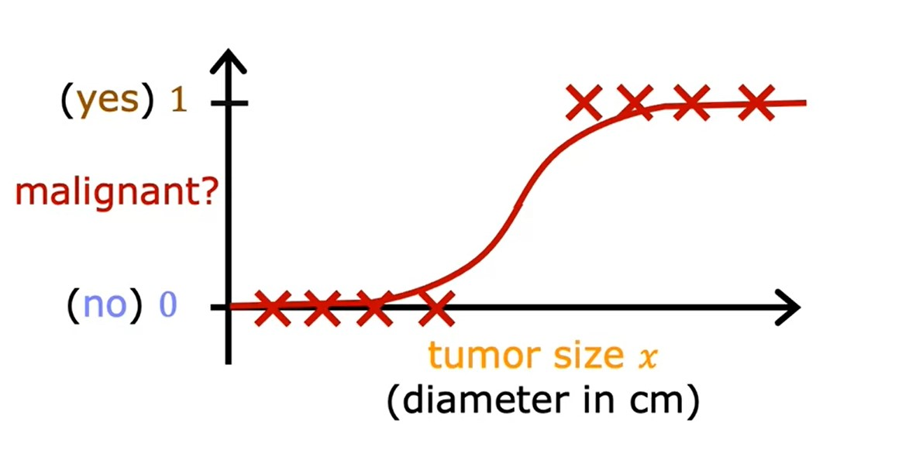

# Week 3: Classification
## Classification with Logistic regression
### Motivations
Classification is different from Regression in that the output $y$ is only one of handful of possible values.
#### Binary classification
* In Binary classification, $y$ can only be one of **two** values, classes or categories.
*  The output class or category will be denoted as:
    * **no** or **yes**
    * `false` or `true`
    * $0$ or $1$ (most commonly used)
    * **negative class** or **positive class**
        * **negative** and **positive** doesn't imply _bad_ vs _good_ but rather convey the message of _absence_ vs _presence_.

[Lab: Classification](./code/C1_W3_Lab01_Classification_Soln.ipynb)

### Logistic regression
* Logistic regression tries to fit the data with a curve like below and output a number (i.e. 0.7) which will be the threshold:  

* To generate output between 0 and 1 we use **sigmoid function** also called **logistic function** which output values between 0 and 1.

$$
g(z) = \frac{1}{1+e^{-z}} \quad \text{Where } 0 < g(z) < 1
$$

* To build Logistic regression, we do it in 2 steps:

$$
\begin{split}
f_{\vec{w},b}(\vec{\mathbf{x}}) & = \vec{\mathbf{w}} \cdot \vec{\mathbf{x}} + b \quad \text{Linear Regression formula} \newline
\text{We assign this }&\text{formula to a variable } z \newline
z & = \vec{\mathbf{w}} \cdot \vec{\mathbf{x}} + b \newline
\text{Then we pass } & z \text{ to the sigmoid function} \newline
g(z) & = \frac{1}{1+e^{-z}} \quad \text{Where } 0 < g(z) < 1
\end{split} \newline
$$

* The final equation for Logistic regression:

$$
\begin{split}
f_{\vec{w},b}(\vec{\mathbf{x}}) & = g(\vec{\mathbf{w}} \cdot \vec{\mathbf{x}} + b) \newline
& = \frac{1}{1+e^{\vec{\mathbf{w}} \cdot \vec{\mathbf{x}} + b}}
\end{split}
$$

* The output of Logistic regression is the **probability** that class is 1.

* Logistic regression can be described by this notation:

$$
f_{\vec{w},b}(\vec{\mathbf{x}}) = P(y=1|\vec{\mathbf{x}};\vec{w},b) \\
\text{Probability that } y \text{ is } 1 \text{, given input } \vec{\mathbf{x}} \text{, parameters } \vec{w},b
$$

[Lab: Sigmoid function and logistic regression](./code/C1_W3_Lab02_Sigmoid_function_Soln.ipynb)

### Decision boundary
* Since the Logistic regression $P(y=1|\vec{\mathbf{x}};\vec{w},b)$ returns the probability of output 1, we need to set a **threshold** so above it, my prediction is = 1.
* A common choice will be to set the **threshold** = 0.5

[Lab: Decision boundary](./code/C1_W3_Lab03_Decision_Boundary_Soln.ipynb)

## Cost function for logistic regression
* The squared error cost function used in Linear Regression won't be suitable for Logistic Regression.
    * In linear regression $J(\vec{w},b)$ is **convex** function.
    * In logistic regression $J(\vec{w},b)$ is **non-convex** function.
    

* As our $f_{wb}(x)$ now has a non-linear component, the sigmoid function:   $f_{w,b}(x^{(i)}) = sigmoid(wx^{(i)} + b )$, Logistic regression requires a cost function more suitable to its non-linear nature.

### Logistic Loss function
* In order to build a cost function suitable for Linear Regression, we will introduce a new function called **Loss Function** $L(f_{\vec{w},b}(\vec{\mathbf{x}}^{(i)}), y^{(i)})$

$$
L(f_{\vec{w},b}(\vec{\mathbf{x}}^{(i)}), y^{(i)}) = 
    \begin{cases}
        -\log{\Big(f_{\vec{w},b}\left(\vec{\mathbf{x}}^{(i)}\right) \Big)} & \text{if } y^{i} = 1 \\
        -\log{\Big(1-f_{\vec{w},b}\left(\vec{\mathbf{x}}^{(i)}\right) \Big)} & \text{if } y^{i} = 0
    \end{cases}
$$

* The Cost function will be the average of the Loss functions for all data points:

$$
J(\vec{w}, b) = \frac{1}{m} \sum\limits_{i=1}^{m}L(f_{\vec{w},b}(\vec{\mathbf{x}}^{(i)}), y^{(i)})
$$

[Lab: Logistic loss](./code/C1_W3_Lab04_LogisticLoss_Soln.ipynb)

### Simplified Cost Function for Logistic Regression
We can simplify the [Logistic Loss function](#logistic-loss-function) and Logistic Cost function to make it easier to implement when applying Gradient descent.

$$
L(f_{\vec{w},b}(\vec{\mathbf{x}}^{(i)}), y^{(i)}) = -y^{(i)} \log{\left(f_{\vec{w},b}\left(\vec{\mathbf{x}}^{(i)}\right)\right)} - \left(1-y^{(i)}\right)\log{\left(1 - f_{\vec{w},b}\left(\vec{\mathbf{x}}^{(i)}\right)\right)}
$$

Using the Simplified Loss function so the cost function $J$ would be:

$$
\begin{split}
J(\vec{w}, b) & = \frac{1}{m} \sum\limits_{i=1}^{m}\left[L(f_{\vec{w},b}(\vec{\mathbf{x}}^{(i)}), y^{(i)})\right] \\
& = -\frac{1}{m} \sum\limits_{i=1}^{m} \left[y^{(i)} \log{\left(f_{\vec{w},b}\left(\vec{\mathbf{x}}^{(i)}\right)\right)} + \left(1-y^{(i)}\right)\log{\left(1 - f_{\vec{w},b}\left(\vec{\mathbf{x}}^{(i)}\right)\right)} \right]
\end{split}
$$

[<<Previous](../week-02/README.md) | [Next>>]()