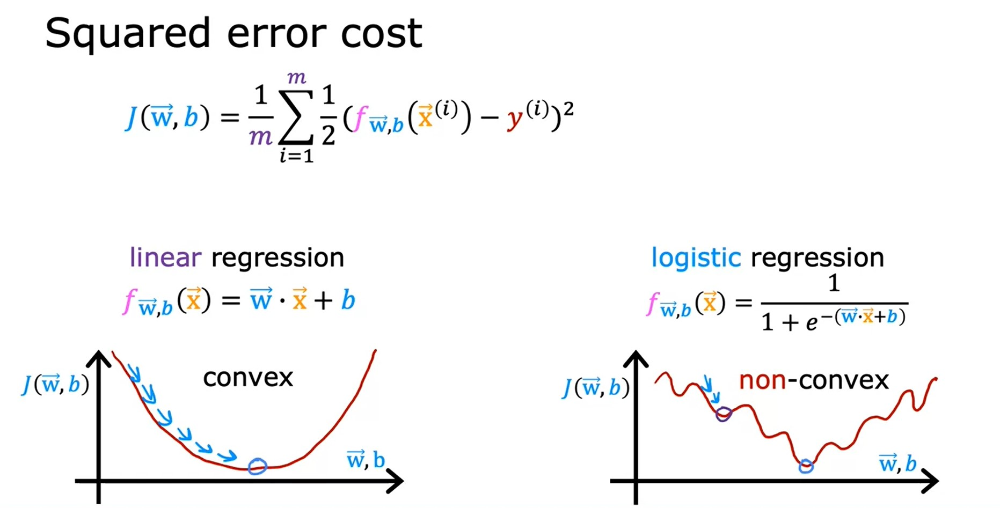
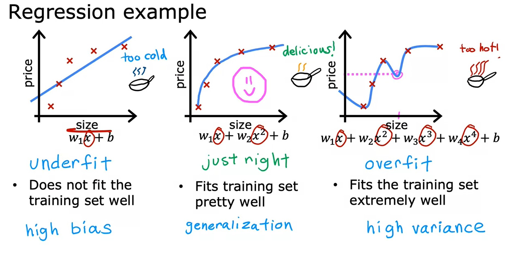
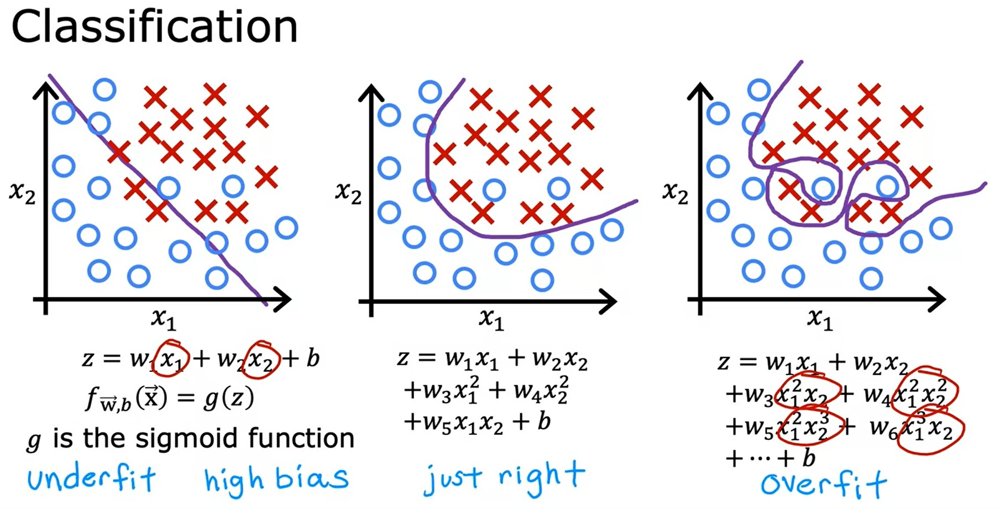

# Week 3: Classification
## Classification with Logistic regression
### Motivations
Classification is different from Regression in that the output $y$ is only one of handful of possible values.
#### Binary classification
* In Binary classification, $y$ can only be one of **two** values, classes or categories.
*  The output class or category will be denoted as:
    * **no** or **yes**
    * `false` or `true`
    * $0$ or $1$ (most commonly used)
    * **negative class** or **positive class**
        * **negative** and **positive** doesn't imply _bad_ vs _good_ but rather convey the message of _absence_ vs _presence_.

[Lab: Classification](./code/C1_W3_Lab01_Classification_Soln.ipynb)

### Logistic regression
* Logistic regression tries to fit the data with a curve like below and output a number (i.e. 0.7) which will be the threshold:  

* To generate output between 0 and 1 we use **sigmoid function** also called **logistic function** which output values between 0 and 1.

$$
g(z) = \frac{1}{1+e^{-z}} \quad \text{Where } 0 < g(z) < 1
$$

* To build Logistic regression, we do it in 2 steps:

$$
\begin{split}
f_{\vec{w},b}(\vec{\mathbf{x}}) & = \vec{\mathbf{w}} \cdot \vec{\mathbf{x}} + b \quad \text{Linear Regression formula} \newline
\text{We assign this }&\text{formula to a variable } z \newline
z & = \vec{\mathbf{w}} \cdot \vec{\mathbf{x}} + b \newline
\text{Then we pass } & z \text{ to the sigmoid function} \newline
g(z) & = \frac{1}{1+e^{-z}} \quad \text{Where } 0 < g(z) < 1
\end{split} \newline
$$

* The final equation for Logistic regression:

$$
\begin{split}
f_{\vec{w},b}(\vec{\mathbf{x}}) & = g(\vec{\mathbf{w}} \cdot \vec{\mathbf{x}} + b) \newline
& = \frac{1}{1+e^{\vec{\mathbf{w}} \cdot \vec{\mathbf{x}} + b}}
\end{split}
$$

* The output of Logistic regression is the **probability** that class is 1.

* Logistic regression can be described by this notation:

$$
f_{\vec{w},b}(\vec{\mathbf{x}}) = P(y=1|\vec{\mathbf{x}};\vec{w},b) \\
\text{Probability that } y \text{ is } 1 \text{, given input } \vec{\mathbf{x}} \text{, parameters } \vec{w},b
$$

[Lab: Sigmoid function and logistic regression](./code/C1_W3_Lab02_Sigmoid_function_Soln.ipynb)

### Decision boundary
* Since the Logistic regression $P(y=1|\vec{\mathbf{x}};\vec{w},b)$ returns the probability of output 1, we need to set a **threshold** so above it, my prediction is = 1.
* A common choice will be to set the **threshold** = 0.5

[Lab: Decision boundary](./code/C1_W3_Lab03_Decision_Boundary_Soln.ipynb)

## Cost function for logistic regression
* The squared error cost function used in Linear Regression won't be suitable for Logistic Regression.
    * In linear regression $J(\vec{w},b)$ is **convex** function.
    * In logistic regression $J(\vec{w},b)$ is **non-convex** function.
    

* As our $f_{wb}(x)$ now has a non-linear component, the sigmoid function:   $f_{w,b}(x^{(i)}) = sigmoid(wx^{(i)} + b )$, Logistic regression requires a cost function more suitable to its non-linear nature.

### Logistic Loss function
* In order to build a cost function suitable for Linear Regression, we will introduce a new function called **Loss Function** $L(f_{\vec{w},b}(\vec{\mathbf{x}}^{(i)}), y^{(i)})$

$$
L(f_{\vec{w},b}(\vec{\mathbf{x}}^{(i)}), y^{(i)}) = 
    \begin{cases}
        -\log{\Big(f_{\vec{w},b}\left(\vec{\mathbf{x}}^{(i)}\right) \Big)} & \text{if } y^{i} = 1 \\
        -\log{\Big(1-f_{\vec{w},b}\left(\vec{\mathbf{x}}^{(i)}\right) \Big)} & \text{if } y^{i} = 0
    \end{cases}
$$

* The Cost function will be the average of the Loss functions for all data points:

$$
J(\vec{w}, b) = \frac{1}{m} \sum\limits_{i=1}^{m}L(f_{\vec{w},b}(\vec{\mathbf{x}}^{(i)}), y^{(i)})
$$

[Lab: Logistic loss](./code/C1_W3_Lab04_LogisticLoss_Soln.ipynb)

### Simplified Cost Function for Logistic Regression
We can simplify the [Logistic Loss function](#logistic-loss-function) and Logistic Cost function to make it easier to implement when applying Gradient descent.

$$
L(f_{\vec{w},b}(\vec{\mathbf{x}}^{(i)}), y^{(i)}) = -y^{(i)} \log{\left(f_{\vec{w},b}\left(\vec{\mathbf{x}}^{(i)}\right)\right)} - \left(1-y^{(i)}\right)\log{\left(1 - f_{\vec{w},b}\left(\vec{\mathbf{x}}^{(i)}\right)\right)}
$$

Using the Simplified Loss function so the cost function $J$ would be:

$$
\begin{split}
J(\vec{w}, b) & = \frac{1}{m} \sum\limits_{i=1}^{m}\left[L(f_{\vec{w},b}(\vec{\mathbf{x}}^{(i)}), y^{(i)})\right] \\
& = -\frac{1}{m} \sum\limits_{i=1}^{m} \left[y^{(i)} \log{\left(f_{\vec{w},b}\left(\vec{\mathbf{x}}^{(i)}\right)\right)} + \left(1-y^{(i)}\right)\log{\left(1 - f_{\vec{w},b}\left(\vec{\mathbf{x}}^{(i)}\right)\right)} \right]
\end{split}
$$

[Lab: Cost function for logistic regression](./code/C1_W3_Lab05_Cost_Function_Soln.ipynb)

### Gradient Descent Implementation
* Gradient descent algorithm:

$$
\begin{align*} 
\text{repeat}&\text{ until convergence:} \; \lbrace \newline
\;  w_{j} &= w_{j} -  \alpha \frac{\partial}{\partial w_{j}} J(\vec{\mathbf{w}},b)   \; \newline 
 b &= b -  \alpha \frac{\partial}{\partial b}  J(\vec{\mathbf{w}},b) \newline
\rbrace & \quad \text{simultaneous update}
\end{align*}
$$

* The devitaves in the above equations are:

$$
\frac{\partial}{\partial w_{j}} J(\vec{\mathbf{w}},b) = \frac{1}{m} \sum\limits_{i=1}^{m}\left(f_{\vec{w},b}\left(\vec{\mathbf{x}}^{(i)}\right) - y^{(i)}\right)x^{(i)}_{j}
$$

$$
\frac{\partial}{\partial b} J(\vec{\mathbf{w}},b) = \frac{1}{m} \sum\limits_{i=1}^{m}\left(f_{\vec{w},b}\left(\vec{\mathbf{x}}^{(i)}\right) - y^{(i)}\right)
$$

* Gradient descent algorithm for Logistic regression is:

$$
\begin{align*} 
\text{repeat}&\text{ until convergence:} \; \lbrace \newline
\;  w_{j} &= w_{j} -  \alpha \frac{\partial}{\partial w_{j}} J(\vec{\mathbf{w}},b)   \; \newline 
& = w_{j} - \left[ \frac{1}{m} \sum\limits_{i=1}^{m}\left(f_{\vec{w},b}\left(\vec{\mathbf{x}}^{(i)}\right) - y^{(i)}\right)x^{(i)}_{j}\right] \newline
 b &= b -  \alpha \frac{\partial}{\partial b}  J(\vec{\mathbf{w}},b) \newline
 & = b -  \alpha \left[\frac{1}{m} \sum\limits_{i=1}^{m}\left(f_{\vec{w},b}\left(\vec{\mathbf{x}}^{(i)}\right) - y^{(i)}\right) \right] \newline
\rbrace & \quad \text{simultaneous update}
\end{align*}
$$

* Even though the above equations look like the ones for the Linear Regression, the main difference is the definition of $f_{\vec{w},b}\left(\vec{\mathbf{x}}\right)$ :

$$
\begin{align*}
\text{Linear Regression: } & f_{\vec{w},b}\left(\vec{\mathbf{x}}\right) = \vec{\mathbf{w}} \cdot \vec{\mathbf{x}} + b \newline
\text{Linear Regression: } & f_{\vec{w},b}\left(\vec{\mathbf{x}}\right) = \frac{1}{1+e^{-(\vec{\mathbf{w}} \cdot \vec{\mathbf{x}} + b)}}
\end{align*}
$$

* Same concepts applies also:
    * Monitor gradient descent (learnging curve)
    * Vectorized implementation
    * Feature scaling

[Lab: Gradient descent for logistic regression](./code/C1_W3_Lab06_Gradient_Descent_Soln.ipynb)

[Lab: Logistic regression with scikit-learn](./code/C1_W3_Lab07_Scikit_Learn_Soln.ipynb)

## The problem of overfitting

### Addressing overfitting
To address overfitting of a model:
1. Collect more training examples.
2. Select features to include/exclude.
    * Many features + insufficient data = overfit
    * Feature selection is using intution to select subset of the features to train the model upon.
    * A disadvantage of feature selection is useful features could be lost.
3. Regularization: Reduce the size of parameters $w_{j}$.

[Lab: Overfitting](./code/C1_W3_Lab08_Overfitting_Soln.ipynb)

### Cost function with regularization
* Regularization tries to make parameters $w_{1}, w_{2}, \dots , w_{n}$ small to reduce overfitting.
* If we have large number of features, it will difficult to know which features to select or reduce.
* The way **Regularization** is typically implemented is to penalize all the features, more precisely, penalize $w_{j}$ parameters.
* So then cost function with regularization would be:

$$
\min_{\vec{\mathbf{w}}, b} J(\vec{\mathbf{w}}, b) = \min_{\vec{\mathbf{w}}, b} \left[\underbrace{\overbrace{\frac{1}{2m} \sum\limits_{i=1}^{m} \left(f_{\vec{\mathbf{w}}, b} \left(\vec{\mathbf{x}}^{(i)} \right) - y^{(i)} \right)^{2}}^{\text{Mean Squared Error}}}_\text{Fit the data} + \underbrace{\overbrace{\frac{\lambda}{2m} \sum\limits_{j=1}^{n} w^{2}_{j}}^{\text{Regularization term}}}_{\text{Keep } w_{j} \text{ small}} \right]
$$

* $\lambda$ is called the regularization parameter.
    * When $\lambda$ is very small $\lambda \approx 0$, the regularization term $\approx 0$ and the model would overfit.
    * If $\lambda$ is very big (i.e. $10^{10}$), the regularization term will be very high and so $f_{\vec{\mathbf{w}}, b}(\vec{\mathbf{x}}) = b$ and the model will underfit.
* By convention, we are NOT penalizing $b$ because it makes almost no difference. 

### Regularized linear regression
* Recall Gradient descent algorithm:

$$
\begin{align*} 
\text{repeat}&\text{ until convergence:} \; \lbrace \newline
\;  w_{j} &= w_{j} -  \alpha \frac{\partial}{\partial w_{j}} J(\vec{\mathbf{w}},b)   \; \newline 
 b &= b -  \alpha \frac{\partial}{\partial b}  J(\vec{\mathbf{w}},b) \newline
\rbrace & \quad \text{simultaneous update}
\end{align*}
$$

* When adding the Regularization term, then the derivatives become:

$$
\begin{align*}
\frac{\partial}{\partial w_{j}} J(\vec{\mathbf{w}},b) & = \frac{1}{m} \sum\limits_{i=1}^{m}\left(f_{\vec{w},b}\left(\vec{\mathbf{x}}^{(i)}\right) - y^{(i)}\right)x^{(i)}_{j} + \frac{\lambda}{m}w_{j} \newline
\frac{\partial}{\partial b} J(\vec{\mathbf{w}},b) & = \frac{1}{m} \sum\limits_{i=1}^{m}\left(f_{\vec{w},b}\left(\vec{\mathbf{x}}^{(i)}\right) - y^{(i)}\right)
\end{align*}
$$

#### Implementing gradient descent
$$
\begin{align*} 
\text{repeat}&\text{ until convergence:} \; \lbrace \newline
\;  w_{j} &= w_{j} -  \alpha \frac{\partial}{\partial w_{j}} J(\vec{\mathbf{w}},b)   \; \newline 
& = w_{j} - \alpha \left[\frac{1}{m} \sum\limits_{i=1}^{m} \left[\left(f_{\vec{\mathbf{w}}, b} \left(\vec{\mathbf{x}}^{(i)} \right) - y{(i)} \right) x_{j}^{(i)} \right] + \frac{\lambda}{m} w_{j} \right] \newline
 b &= b -  \alpha \frac{\partial}{\partial b}  J(\vec{\mathbf{w}},b) \newline
 &= b - \alpha \frac{1}{m} \sum\limits_{i=1}^{m}\left(f_{\vec{\mathbf{w}}, b} \left(\vec{\mathbf{x}}^{(i)} \right) - y{(i)} \right) \newline
\rbrace & \quad \text{simultaneous update}
\end{align*}
$$

##### Detailed Gradient descent
* To look into more details of the formula of $w_{j}$:

$$
\begin{align*}
w_{j} &= w_{j} - \alpha \left[\frac{1}{m} \sum\limits_{i=1}^{m} \left[\left(f_{\vec{\mathbf{w}}, b} \left(\vec{\mathbf{x}}^{(i)} \right) - y{(i)} \right) x_{j}^{(i)} \right] + \frac{\lambda}{m} w_{j} \right] \newline
& = \underbrace{1 \cdot w_{j} - \alpha \frac{\lambda}{m} w_{j}}_{\text{Simplify below}} - \underbrace{\alpha \frac{1}{m} \sum\limits_{i=1}^{m}\left(f_{\vec{\mathbf{w}}, b} \left(\vec{\mathbf{x}}^{(i)} \right) - y{(i)} \right) x_{j}^{(i)}}_{\text{Usual Update}} \newline
& = w_{j} \left(1 - \alpha \frac{\lambda}{m} \right) - \left[\alpha \frac{1}{m} \sum\limits_{i=1}^{m}\left(f_{\vec{\mathbf{w}}, b} \left(\vec{\mathbf{x}}^{(i)} \right) - y{(i)} \right) x_{j}^{(i)} \right]
\end{align*}
$$

* To understand how the expression $w_{j} \left(1 - \alpha \frac{\lambda}{m} \right)$, we assume:
    * Learning rate is small value $\alpha = 0.01$.
    * Regularization term $\lambda = 1$
    * The training set size $m=50$

$$
\begin{align*}
1 - \alpha \frac{\lambda}{m} & = 1 - 0.01 \cdot \frac{1}{50} \newline
& = 1 - 0.0002 \newline
& = 0.9998
\end{align*}
$$

* So every iteration, we multiply $w_{j} * 0.9998$, so each iteration will shrink the value of $w_{j}$ a little bit.

### Regularized logistic regression
To add a regularization term for Logistic regression

$$
J(\vec{w}, b) & = -\frac{1}{m} \sum\limits_{i=1}^{m} \left[y^{(i)} \log{\left(f_{\vec{w},b}\left(\vec{\mathbf{x}}^{(i)}\right)\right)} + \left(1-y^{(i)}\right)\log{\left(1 - f_{\vec{w},b}\left(\vec{\mathbf{x}}^{(i)}\right)\right)} \right] + \frac{\lambda}{2m} \sum\limits_{j=1}^{n} w_{j}^{2}
$$

#### Implementing Gradient descent for Regularized logistic regression
$$
\begin{align*} 
\text{repeat}&\text{ until convergence:} \; \lbrace \newline
\;  w_{j} &= w_{j} -  \alpha \frac{\partial}{\partial w_{j}} J(\vec{\mathbf{w}},b)   \; \newline 
& = w_{j} - \alpha \left[\frac{1}{m} \sum\limits_{i=1}^{m} \left[\left(f_{\vec{\mathbf{w}}, b} \left(\vec{\mathbf{x}}^{(i)} \right) - y{(i)} \right) x_{j}^{(i)} \right] + \frac{\lambda}{m} w_{j} \right] \newline
 b &= b -  \alpha \frac{\partial}{\partial b}  J(\vec{\mathbf{w}},b) \newline
 &= b - \alpha \frac{1}{m} \sum\limits_{i=1}^{m}\left(f_{\vec{\mathbf{w}}, b} \left(\vec{\mathbf{x}}^{(i)} \right) - y{(i)} \right) \newline
\rbrace & \quad \text{simultaneous update}
\end{align*}
$$

[Lab: Regularization](./code/C1_W3_Lab09_Regularization_Soln.ipynb)

[<<Previous](../week-02/README.md) | [Next>>](../../Course-02-Advanced%20Learning%20Algorithms/README.md)