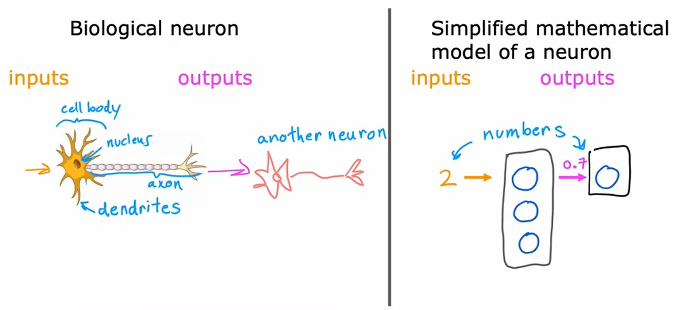
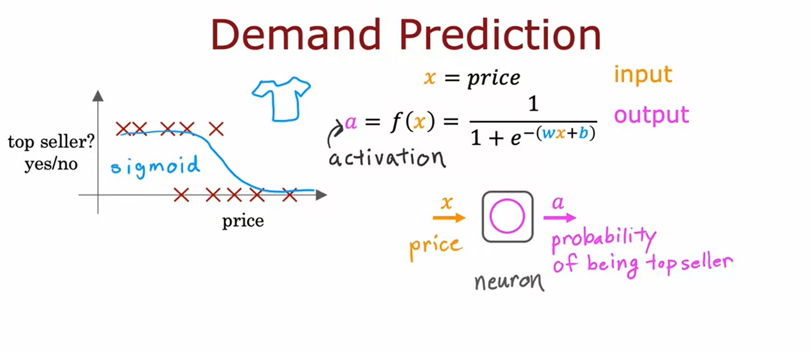
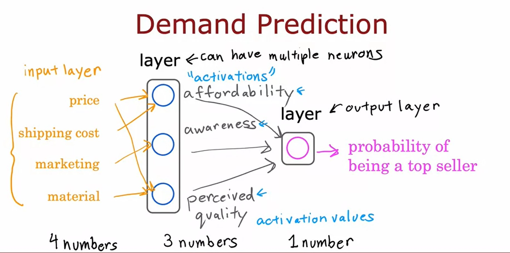
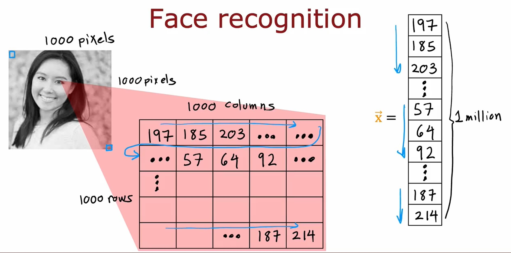
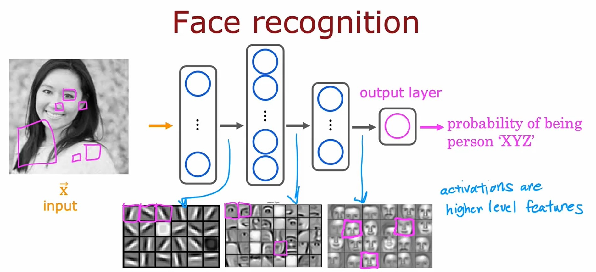
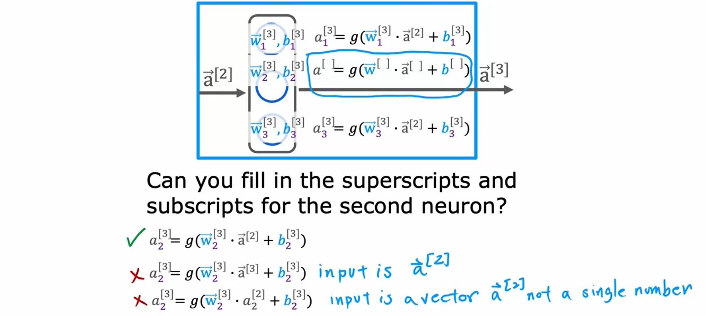
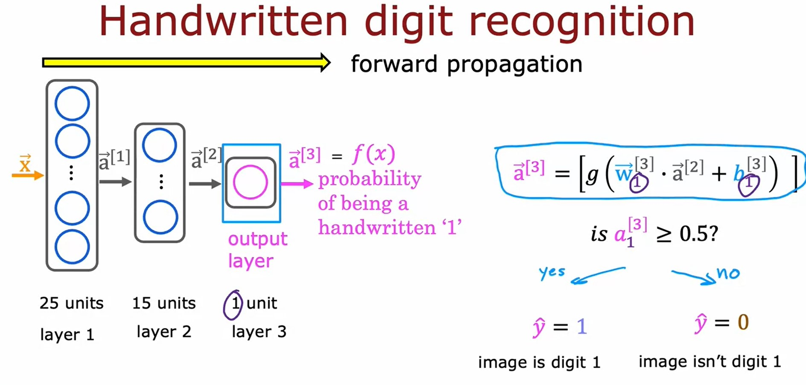

# Week 1: Neural Networks
## Neural networks intuition
### Neurons and the brain
* _Neural Networks_ has started with the motivation of trying to build software to mimic the brain.
* Since around 2005, it has been rebranded into _Deep Learning_.
* Currently they are used in many fields like:
    * Speech Recognition
    * Computer Vision
    * Natural Language Processing

* The artificial neural network uses a very simplified Mathematical model of what a biological neuron does
    * What a neuron does is it takes some inputs, one or more inputs, which are just numbers. 
    * It does some computation and it outputs some other number, which then could be an input to a second neuron.
    * When you're building an artificial neural network or deep learning algorithm, rather than building one neuron at a time, you often want to simulate many such neurons at the same time.

### Example: Demand Prediction
* We'll use an example from demand prediction in which you look at the product and try to predict, will this product be a top seller or not?
* In this example, you're selling T-shirts and you would like to know if a particular T-shirt will be a top seller, yes or no, and you have collected data of different t-shirts that were sold at different prices, as well as which ones became a top seller.
* In this example, the input feature $x = \text{price}$ of the T-shirt, and so that's the input to the learning algorithm. 
* If you apply _logistic regression_ to fit a _sigmoid function_ to the data that might look like that then the outputs of your prediction might look like this $f(x) = \frac{1}{1+e^{-(wx + b)}}$

* To set us up to build a neural network we are going to switch the terminology and use alphabet $a$ to denote the _logistic regression_ output.
    * The term $a$ stands for _activation_
* This logistic regression units or this little logistic regression algorithm, can be thought of as a very simplified model of a single neuron in the brain.
    * Where what the neuron does is it takes us input the price $x$, and then it computes this formula on top, and it outputs the number $a$, which is computed by this formula, and it outputs the probability of this T-shirt being a top seller.
* Given this description of a single neuron, building a neural network now it just requires taking a bunch of these neurons and wiring them together or putting them together.
----------
* Let's now look at a more complex example of demand prediction.

* In this example, we're going to have four features to predict whether or not a T-shirt is a top seller.The features are:
    * Price.
    * Shipping Cost.
    * Amount of Marketing.
    * Material Quality.
* you might suspect that whether or not a T-shirt becomes a top seller actually depends on a few factors:
    * Affordability
    * Awareness
    * Perceived Quality
* What I'm going to do is:
    * Create one artificial neuron to try to estimate the probability that this T-shirt is perceive as highly affordable. 
        * _Affordability_ is mainly a function of _price_ and _shipping costs_. 
        * We're going to use a little neuron here, a logistic regression unit to input _price_ and _shipping costs_ and predict do people think this is affordable? 
    * Second, I'm going to create another artificial neuron here to estimate, is there high awareness of this? 
        * _Awareness_ in this case is mainly a function of the _marketing_ of the T-shirt. 
    * Finally, going to create another neuron to estimate do people perceive this to be of _high quality_
        * That may mainly be a function of the _price_ of the T-shirt and of the _material quality_. 
        * _Price_ is a factor here because if there's a very high priced T-shirt, people will sometimes perceive that to be of high quality.
* Given these estimates of _affordability_, _awareness_, and _perceived quality_ we then wire the outputs of these three neurons to another neuron, that then there's another logistic regression unit That finally inputs those three numbers and outputs the probability of this t-shirt being a top seller.
* In the terminology of neural networks, we're going to group these three neurons together into what's called a _layer_. 
    > **Terminology** _Layer_:  
    > A _layer_ is a grouping of neurons which takes as input the same or similar features, and that in turn outputs a few numbers together.  
    > A _layer_ can have multiple neurons or it can also have a single neuron:
    > * The _input layer_: is the layer of the input features. $\vec{x}$
    > * The _hidden layer_: is the layer(s) in the middle of the network that calculate the activation values. $\vec{a}$
    > * The _output layer_: is the layer with the final neuron that the output probability predicted by the neural network.

* In the terminology of neural networks we're also going to call affordability, awareness and perceived quality to be _activations_.

* In this example, this particular neural network therefore carries out computations as follows:
    1. It inputs 4 numbers.
    2. Then this layer of the neural network uses those 4 numbers to compute the new numbers also called _activation values_ (3 numbers).
    3. Then the final layer, the output layer of the neural network used those 3 numbers to compute 1 number.
* In a neural network this list of 4 numbers is also called the _input layer_.

> The way a neural network is implemented in practice each neuron in a certain layer will have access to every feature from the previous layer.   
You can imagine that if you're trying to predict affordability and it knows what's the price shipping cost marketing and material, may be you'll learn to ignore marketing and material and just figure out through setting the parameters appropriately to only focus on the subset of features that are most relevant to affordability.

### Example: Recognizing Images
* If you're building a face recognition application, you might want to train a neural network that takes as input a picture like this and outputs the identity of the person in the picture.

* This image is 1,000 by 1,000 pixels. Its representation in the computer is actually as 1,000 by 1,000 grid, or also called 1,000 by 1,000 matrix of _pixel intensity values_.
* If you were to take these pixel intensity values and unroll them into a vector, you end up with a list or a vector of a million pixel intensity values.  
    >The face recognition problem is, can you train a neural network that takes as input a feature vector with a million pixel brightness values and outputs the identity of the person in the picture.  

    
* This is how you might build a neural network to carry out this task. The input image $\vec{\mathbf{x}}$ is fed to this layer of neurons. 
    * This is the first hidden layer, which then extract some features. 
    * The output of this first hidden layer is fed to a second hidden layer
    * That output is fed to a third layer
    * Then finally to the output layer, which then estimates, say the probability of this being a particular person.
----------
## Neural network model
### Neural network layer
* The fundamental building block of most modern neural networks is a layer of neurons.
* When you build neural networks with multiple layers, it'll be useful to give the layers different numbers.
* By convention, we give numbers to our layers:
    * _Layer 0_ (Input $\vec{\mathbf{x}}$)
    * _Layer 1_
    * _Layer 2_
    * ... etc
* In order to introduce notation to help us distinguish between the different layers, we are going to add superscript index to the output and variables of each layer:
    * $\vec{a}^{[1]}$ is the output of layer 1
    * $\vec{a}^{[1]} = g(\vec{\mathbf{w}_{1}}^{[1]} \cdot \vec{\mathbf{x}} + b_{1}^{[1]})$ is the activation function of _neuron 1_ in _layer 1_

### More complex neural networks

The general notation form of this equation for an arbitray layer $l$ and for an arbitray unit $j$ is:

$$
a_{j}^{[l]} = g(\vec{\mathbf{w}}_{j}^{[l]} \cdot \vec{a}^{[l-1]} + b_{j}^{[l]})
$$

> **Note**  
> This form is generic so when we apply it to the input later _Layer 0_ it becomes:  
> $$\vec{\mathbf{x}} = \vec{a}^{[0]} $$

### Inference: making predictions (forward propagation)

* This computation goes from left to right, you start from $\vec{\mathbf{x}}$ and compute $\vec{a}^{[1]}$, then $\vec{a}^{[2]}$, then $\vec{a}^{[3]}$.
* This algorithm is also called _forward propagation_ because you're propagating the activations of the neurons.
* This is in contrast to a different algorithm called _backward propagation_ or _back propagation_, which is used for learning.
* This type of neural network architecture where you have more hidden units initially and then the number of hidden units decreases as you get closer to the output layer, is a pretty typical choice when choosing neural network architectures.

[<<Previous](../README.md) | [Next>>]()