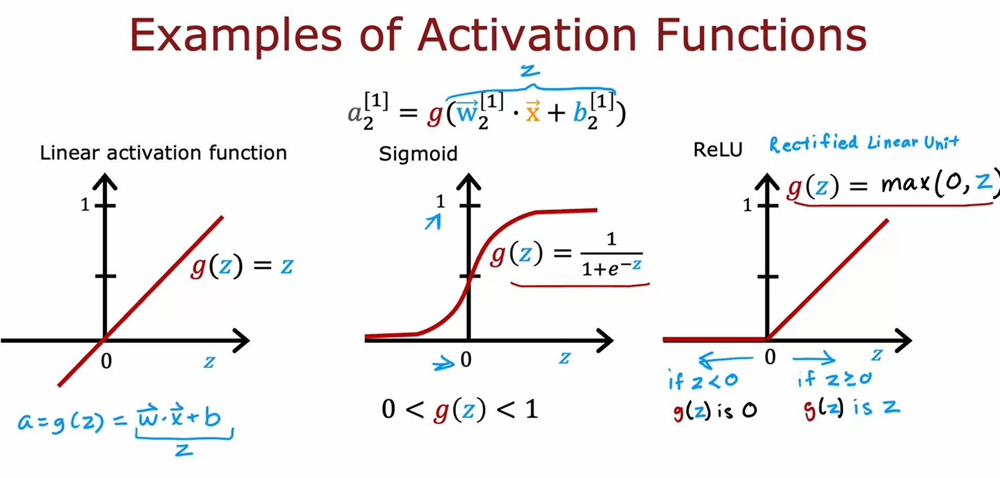

# Neural network training
## Neural Network Training
### TensorFlow implementation

Given set of $(x,y)$ examples, how to build and train neural network in the code?
1. Ask TensorFlow to string together the neural network layers:
    ```python
    import tensorflow as tf
    from tensorflow.keras.models import Sequential
    from tensorflow.keras.layers import Dense

    model = Sequential(
        [               
            tf.keras.Input(shape=(400,)),
            Dense(25, activation='sigmoid', name = 'layer1'),
            Dense(15, activation='sigmoid', name = 'layer2'),
            Dense(1, activation='sigmoid', name = 'layer3')
        ], name = "my_model" 
    )
    ```
2. Ask TensorFlow to compile together the model and specify the _Loss_ function (in this case we use `BinaryCrossentropy` loss function)
    ```python
    from tensorflow.keras.losses import BinaryCrossentropy

    model.compile(loss=BinaryCrossentropy())
    ```
3. Call the `fit` function to fit the model to the data set `X, Y` and specify how many steps in the gradient descent `epochs`
    ```python
    model.fit(X, y, epochs=100)
    ```
### Training Details
#### Model Training Steps
<table>
<tr>
<th>Step</th><th>Logistic Regression</th><th>Neural Network</th>
</tr>
<tr>
<td>

Speicfy how to compute output given input $x$ and parameters $w, b$ (defined model)

</td>
<td>

```python
z = np.dot(w,x) + b
f_x = 1/(1+np.exp(-z))
```

</td>
<td>

```python
model = Sequential([ 
            Dense(...),
            Dense(...),
            Dense(...)
        ])
```

</td>
</tr>
<tr>
<td>

Specify _loss_ and _cost_<br>$L(f_{\vec{\mathbf{w}},b}(\vec{\mathbf{X}}), \mathbf{y})$ <br> $J(\vec{\mathbf{w}}, b) = \frac{1}{m} \sum\limits_{i=i}^{m}{L(f_{\vec{\mathbf{w}},b}(\vec{\mathbf{X}}^{(i)}), \mathbf{y}^{(i)})}$

</td>
<td>

```python
loss = -y * np.log(f_x) - (1-y) * np.log(1-f_x)
```

</td>
<td>

```python
model.compile(loss=BinaryCrossentropy())
```

</td>
</tr>
<tr>
<td>

Train on data to minimize $J(\vec{\mathbf{w}}, b)$ using Gradient Descent

</td>
<td>

```python
w = w - alpha * dj_dw
b = b - alpha * dj_db
```

</td>
<td>

```python
model.fit(X, y, epochs=100)
```

</td>
</tr>
</table>

1. In the first step we create the model and define the layers and the activation function of each layer.
2. Loss and Cost functions
    * `BinaryCrossentropy` is commonly used with Logistic Binary classification.
    * `MeanSquaredError` is commonly used with regression.
3. Gradient Descent
    * TensorFlow uses **back propagation** to compute derivatives used in gradient descent.

## Activation Functions
### Alternatives to the sigmoid activation

* We have already seen the **sigmoid** activation function $g(\mathbf{z}) = \frac{1}{1+e^{-\mathbf{z}}}$
* Another common activation function is **ReLU** (Rectified Linear Unit) $g(\mathbf{z}) = \max(0,\mathbf{z})$
* Also, we have the **Linear Activation Function** $g(\mathbf{z}) = \mathbf{z}$
### Choosing activation functions
#### Output Layer
* It turns out that there'll often be one fairly natural choice, depending on what is the target or the ground truth label $\mathbf{y}$.
    * When working on a binary classification problem where $\mathbf{y}$ is either $0$ or $1$, then the **sigmoid** activation function will almost always be the most natural choice.
    * When working on regression problem where $\mathbf{y} = +/-$, we can use the **Linear Activation Function**.
    * When working on regression problem where $\mathbf{y} = 0 \text{ or } +$ then we can use **ReLU**
#### Hidden Layer
* **ReLU** activation function is the most commonly used activation function used.
    * It is much faster that the sigmoid
### Why do we need activation functions?
* If we used **Linear Activation Functino** in all the neurons in the neural network, then the whole neural network will act as simple Linear Regression.

[Lab: ReLU activation](./code/C2_W2_Relu.ipynb)

## Multiclass Classification
### Multiclass
_Multiclass Classification_ refers to classification problems where you can have more than just two possible output labels so not just 0 or 1.
### Softmax
* The _Softmax Regression Algorithm_ is a generalization of logistic regression, which is a binary classification algorithm to the multiclass classification contexts.
* Recall Logistic regression (2 possible output values) 

$$
\begin{align*}
\mathbf{z} & = \vec{\mathbf{w}} \cdot \vec{\mathbf{x}} + b \newline
a_{1} & = g(\mathbf{z}) = \frac{1}{1+ e^{-\mathbf{z}}} = P(\mathbf{y} = 1|\vec{\mathbf{x}}) \newline
a_{2} & = 1 - a_{1} = P(\mathbf{y} = 0|\vec{\mathbf{x}})
\end{align*}
$$

* Softmax regression (4 possible output values) $y=1,2,3,4$

$$
\begin{align*}
\mathbf{z}_{1} = \vec{\mathbf{w}}_{1} \cdot \vec{\mathbf{x}} + b_{1} \quad \rightarrow \quad a_{1} = \frac{e^{\mathbf{z}_1}}{e^{\mathbf{z}_{1}} + e^{\mathbf{z}_2} + e^{\mathbf{z}_3} + e^{\mathbf{z}_4}} = P(\mathbf{y} = 1|\vec{\mathbf{X}}) \newline
\mathbf{z}_{2} = \vec{\mathbf{w}}_{2} \cdot \vec{\mathbf{x}} + b_{2} \quad \rightarrow \quad a_{2} = \frac{e^{\mathbf{z}_{2}}}{e^{\mathbf{z}_1} + e^{\mathbf{z}_2} + e^{\mathbf{z}_3} + e^{\mathbf{z}_4}} = P(\mathbf{y} = 2|\vec{\mathbf{X}}) \newline
\mathbf{z}_{3} = \vec{\mathbf{w}}_{3} \cdot \vec{\mathbf{x}} + b_{3} \quad \rightarrow \quad a_{3} = \frac{e^{\mathbf{z}_{3}}}{e^{\mathbf{z}_1} + e^{\mathbf{z}_2} + e^{\mathbf{z}_3} + e^{\mathbf{z}_4}} = P(\mathbf{y} = 3|\vec{\mathbf{X}}) \newline
\end{align*}
$$

$$
\begin{align*}
\mathbf{z}_{4} = \vec{\mathbf{w}}_{4} \cdot \vec{\mathbf{x}} + b_{4} \quad \rightarrow \quad a_{4} = \frac{e^{\mathbf{z}_{4}}}{e^{\mathbf{z}_1} + e^{\mathbf{z}_2} + e^{\mathbf{z}_3} + e^{\mathbf{z}_4}} = P(\mathbf{y} = 4|\vec{\mathbf{X}}) 
\end{align*}
$$

* So the general formulas for the Softmax regression algorith ( $N$ Possible outputs) $y = 1,2,3, \dots , N$ is:

$$
\begin{align*}
\mathbf{z}_{j} = \vec{\mathbf{w}}_{j} \cdot \vec{\mathbf{x}} + b_{j} \qquad j = 1, \dots , N \\
a_{j} = \frac{e^{\mathbf{z}_{j}}}{\sum\limits_{k=1}^{N}{e^{\mathbf{z}_{k}}}} = P(\mathbf{y} = j|\vec{\mathbf{X}}) \\
\text{Note: } a_{1} + a_{2} + \dots + a_{N} = 1
\end{align*}
$$


#### Cost for Softmax regression
The Softmax Crossentropy loss is:

$$
loss(a_{a}, \dots , a_{N}, \mathbf{y}) = \begin{dcases}
-\log{a_{1}} \quad \text{if } \mathbf{y} = 1 \\
-\log{a_{2}} \quad \text{if } \mathbf{y} = 2 \\
\qquad \vdots \\
-\log{a_{N}} \quad \text{if } \mathbf{y} = N \\
\end{dcases}
$$

### Neural Network with Softmax output
In order to build a Neural Network that can carry out _multi class classification_, we're going to take the _Softmax regression model_ and put it into essentially the **output layer** of a Neural Network.
1. Specify the model $f_{\vec{\mathbf{W}},b}(\vec{\mathbf{X}})$
    ```python
    import tensorflow as tf
    from tensorflow.keras.models import Sequential
    from tensorflow.keras.layers import Dense

    model = Sequential([               
            Dense(units=25, activation='relu'),
            Dense(units=15, activation='relu'),
            Dense(units=10, activation='softmax')
        ])
    ```
2. Specify loss and cost
    ```python
    from tf.keras.losses import SparseCategoricalCrossentropy
    model.compile(loss=SparseCategoricalCrossentropy())
    ```
3. Train on data to minimize $J(\vec{\mathbf{W}}, b)$
    ```python
    model.fit(X, y, epochs=100)
    ```
### Improved implementation of softmax
To avoid issues with numerical roundoff, it is better to use the below code:
```python
model = Sequential([               
        Dense(units=25, activation='relu'),
        Dense(units=15, activation='relu'),
        Dense(units=10, activation='linear')
    ])
model.compile(loss=SparseCategoricalCrossentropy(from_logits=True))
```
### Classification with multiple outputs
* There's a different type of classification problem called a multi-label classification problem, which is where associate of each image, they could be multiple labels.
* It is possible to build a neural network for each label
* Alternatively, train one neural network with multiple outputs (the output layer is multiple sigmoid neurons)

[Lab: Softmax](./code/C2_W2_SoftMax.ipynb)

[Lab: Multiclass](./code/C2_W2_Multiclass_TF.ipynb)

## Additional Neural Network Concepts
### Advanced Optimization
* Recently, there is other optimization algorithms better than Gradient Descent.
* A commonly used algotithm is **Adam** (Adaptive Moment estimation) which can adjust the learning rate $\alpha$ automatically:
    * If the the steps towards the minimum is in the same direction so it increases the learning rate $\alpha$ to go faster.
    * If the steps is oscilating and changes direction then it decreases the learning rate $\alpha$ to ga slower.
    * It doesn't use a global $\alpha$ but seperate value for each parameter.

[<<Previous](../week-01/README.md) | [Next>>]()