# Advice for applying machine learning
## Advice for applying machine learning
#### Debugging a learning algorithm
* Recall the regularized linear regression cost function:

$$
J(\vec{\mathbf{w}}, b) = \frac{1}{2m}\sum\limits_{i=1}^{m}{\left(f_{\vec{\mathbf{w}}, b}\left(\vec{\mathbf{x}}^{(i)}\right) - \mathbf{y}^{(i)}\right)^{2}} + \frac{\lambda}{2m} \sum\limits_{j=1}^{n}{\mathbf{w}^{2}_{j}}
$$

* If the model makes unacceptably large errors in prediction, we can try:
    * Get more training example.
    * Try smaller set of features.
    * Try getting additional features.
    * Try adding polynomial features $(x_{1}^{2}, x_{2}^{2}, x_{1}, x_{2}, \text{etc})$.
    * Try decreasing $\lambda$
    * Try increasing $\lambda$
#### Machine Learning Diagnostics
* **Diagnostic**: A test that you run to gain insight into what is/isn't working with a learning algorithm, to gain guidance into improving its performance.
### Evaluating a model
* **Overfitting**: Model fits the training data well but will fail to generalize to new examples not in the training set.
* We need some more systematic way to evaluate how well your model is doing. One technique, we can use is to split the training set into two subsets.:
    * 70% of the data to be **training set** $m_{train} = \text{No. training examples}$.
    * 30% of the data to be **testing set** $m_{test} = \text{No. test examples}$.
#### Train/test procedure for linear regression (with squared error cost)
* Fit parameters by minimizing cost function $J(\vec{\mathbf{w}},b)$ to find $\vec{\mathbf{w}},b$:

$$
J(\vec{\mathbf{w}}, b) = \frac{1}{2m_{train}}\sum\limits_{i=1}^{m_{train}}{\left(f_{\vec{\mathbf{w}}, b}\left(\vec{\mathbf{x}}^{(i)}\right) - \mathbf{y}^{(i)}\right)^{2}} + \frac{\lambda}{2m_{train}} \sum\limits_{j=1}^{n}{\mathbf{w}^{2}_{j}}
$$

* Compute test error:

$$
J_{test}(\vec{\mathbf{w}}, b) = \frac{1}{2m_{test}}\sum\limits_{i=1}^{m_{test}}{\left(f_{\vec{\mathbf{w}}, b}\left(\vec{\mathbf{x}}_{test}^{(i)}\right) - \mathbf{y}_{test}^{(i)}\right)^{2}}
$$

* Compute training error:

$$
J_{train}(\vec{\mathbf{w}}, b) = \frac{1}{2m_{train}}\sum\limits_{i=1}^{m_{train}}{\left(f_{\vec{\mathbf{w}}, b}\left(\vec{\mathbf{x}}_{train}^{(i)}\right) - \mathbf{y}_{train}^{(i)}\right)^{2}}
$$

#### Train/test procedure for classification problem
* Fit parameters by minimizing cost function $J(\vec{\mathbf{w}},b)$ to find $\vec{\mathbf{w}},b$:

$$
J(\vec{\mathbf{w}}, b) = -\frac{1}{m_{train}}\sum\limits_{i=1}^{m_{train}}{\left[\mathbf{y}^{(i)} \log \left(f_{\vec{\mathbf{w}}, b}\left(\vec{\mathbf{x}}^{(i)}\right) \right) + \left(1- \mathbf{y}^{(i)} \right) \log \left(1-f_{\vec{\mathbf{w}}, b}\left(\vec{\mathbf{x}}^{(i)}\right)\right) \right]} + \frac{\lambda}{2m_{train}}\sum\limits_{j=1}^{n}{\mathbf{w}_{j}^{2}}
$$

* Compute test error:

$$
J_{test}(\vec{\mathbf{w}}, b) = -\frac{1}{m_{test}}\sum\limits_{i=1}^{m_{test}}{\left[\mathbf{y}_{test}^{(i)} \log \left(f_{\vec{\mathbf{w}}, b}\left(\vec{\mathbf{x}}_{test}^{(i)}\right) \right) + \left(1- \mathbf{y}_{test}^{(i)} \right) \log \left(1-f_{\vec{\mathbf{w}}, b}\left(\vec{\mathbf{x}}_{test}^{(i)}\right)\right) \right]}
$$

* Compute training error:

$$
J_{train}(\vec{\mathbf{w}}, b) = -\frac{1}{m_{train}}\sum\limits_{i=1}^{m_{train}}{\left[\mathbf{y}_{train}^{(i)} \log \left(f_{\vec{\mathbf{w}}, b}\left(\vec{\mathbf{x}}_{train}^{(i)}\right) \right) + \left(1- \mathbf{y}_{train}^{(i)} \right) \log \left(1-f_{\vec{\mathbf{w}}, b}\left(\vec{\mathbf{x}}_{train}^{(i)}\right)\right) \right]}
$$

### Model selection and training/cross validation/test sets
* When having multiple models to select from, using only $J_{test}(\vec{\mathbf{w}}, b)$ is likely to be an optimistic estimate of generalization error because it relies only on the test set.
* To select a model out of possible multiple models, we need to modify the procedure by splitting our data into 3 different datasets:
    * **Training Set**: $m_{train} \approx 60\%$ of the data.
    * **Cross Validation Set**: $m_{cv} \approx 20\%$ of the data. Other names of this data set:
        * _Validation Set_.
        * _Development Set_.
        * _Dev Set_.
    * **Test Set**: $m_{train} \approx 20\%$ of the data.
* So to select a model, this can be done based on the Cross Validation error $J_{cv}(\vec{\mathbf{w}}, b)$.
* To estimate generalization error, this can be done using the Test error $J_{test}(\vec{\mathbf{w}}, b)$

[Lab: Model Evaluation and Selection](./code/C2W3_Lab_01_Model_Evaluation_and_Selection.ipynb)

## Bias and variance
### Diagnosing bias and variance
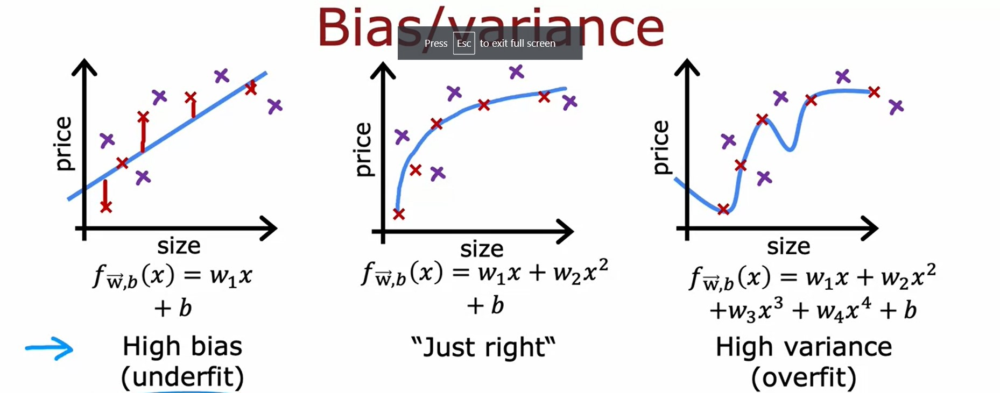
* **High Bias**: Underfit
    * $J_{traing}$ is high.
    * $J_{cv}$ is high. $J_{traing} \approx J_{cv}$
* **High Variance**: Overfit
    * $J_{traing}$ is/maybe low.
    * $J_{cv}$ is high. $J_{cv} >> J_{traing}$
* **Just Right**:
    * $J_{traing}$ is low.
    * $J_{cv}$ is low.

It rarely happens but for some reason a model can have **high bias and high variance** where $J_{train}$ will be high and $J_{cv} >> J_{train}$

### Regularization and bias/variance
* Recall Linear Regression model:

$$
\begin{align*}
f_{\vec{\mathbf{w}},b}(x) & = \mathbf{w}_{1}x + \mathbf{w}_{2}x^{2} + \mathbf{w}_{3}x^{3} + \mathbf{w}_{4}x^{4} + b \newline
J(\vec{\mathbf{w}},b) & = \frac{1}{2m} \sum\limits_{i=1}^{m}{ \left(f_{\vec{\mathbf{w}},b}\left(\vec{\mathbf{x}}^{(i)}\right) - \mathbf{y}^{(i)} \right)^{2} } + \frac{\lambda}{2m} \sum\limits_{j=1}^{n}{\mathbf{w}_{j}^{2}}
\end{align*}
$$

* Large $\lambda \implies$ High bias (underfit)
    * $\lambda = 10,000 \implies \mathbf{w}_{1} \approx 0, \mathbf{w}_{2} \approx 0 \implies f_{\vec{\mathbf{w}},b}(\vec{\mathbf{X}}) \approx 0$
    * $J_{train}(\vec{\mathbf{w}},b)$ is large
* Small $\lambda \implies$ High variance (Overfit)
    * $\lambda = 0 \implies$ no regularization.
    * $J_{train}(\vec{\mathbf{w}},b)$ is small but $J_{cv}(\vec{\mathbf{w}},b)$ is large.
* To select the best value for $\lambda$, we will use an approach similar to one used in [Model selection and training/cross validation/test sets](#model-selection-and-trainingcross-validationtest-sets)

### Establishing a baseline level of performance
What is the level of error you can reasonably hope to get to?
* Human level performance.
* Competing algorithms performance.
* Guess based on experience.

### Learning curves
Learning curves are a way to help understand how a learning algorithm is doing as a function of the amount of experience it has, whereby experience, we mean, for example, the number of training examples it has.
* As $m_{train}$, the training set size gets bigger, then you learn a better model and so the cross-validation error goes down.
* As the training set gets bigger, the training error increases because it's harder to fit all of the training examples perfectly.
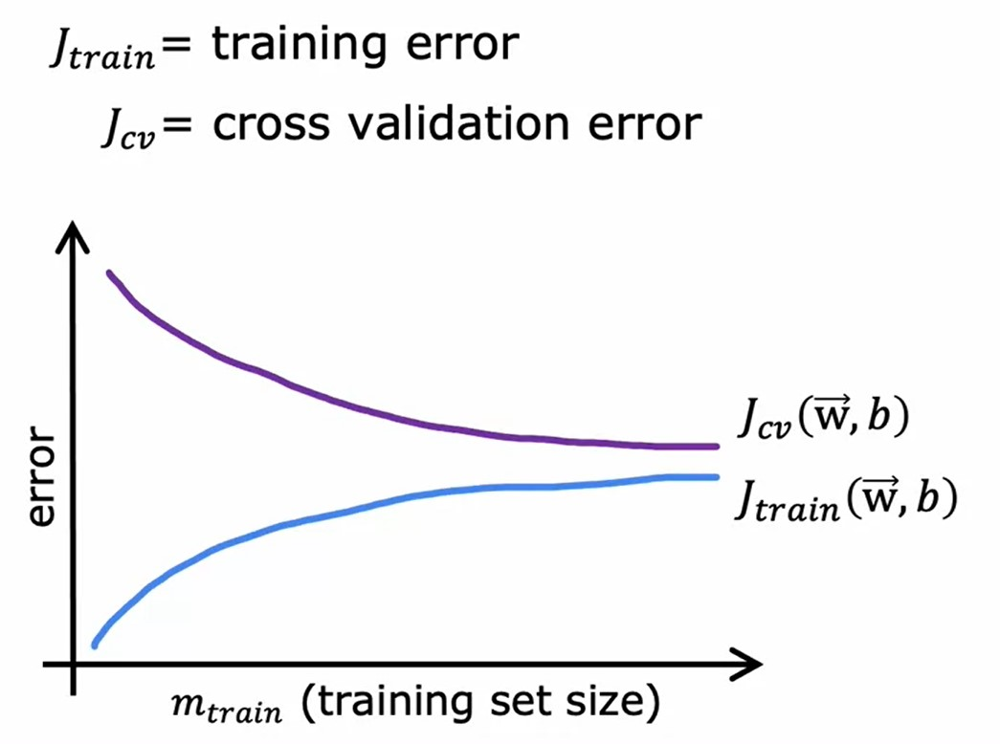

#### High Bias
* If a learning algorithm suffers from high bias, getting more training data will not (by itself) help much.

#### High Variance
* If a learning algorithm suffers from high variance, getting more training data is likely to help.
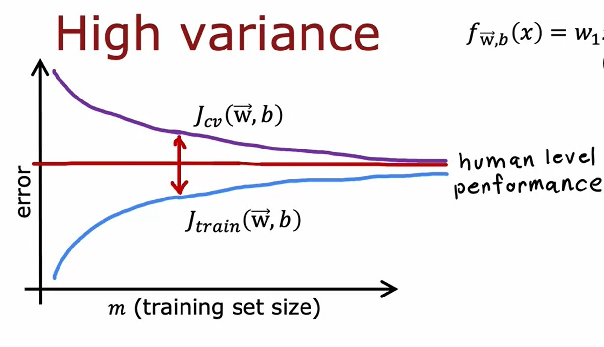

### Deciding what to try next revisited

$$
J(\vec{\mathbf{w}},b) = \frac{1}{2m} \sum\limits_{i=1}^{m}{ \left(f_{\vec{\mathbf{w}},b}\left(\vec{\mathbf{x}}^{(i)}\right) - \mathbf{y}^{(i)} \right)^{2} } + \frac{\lambda}{2m} \sum\limits_{j=1}^{n}{\mathbf{w}_{j}^{2}}
$$

If the results of regularized linear regression makes large errors in prediction:
Action | Fixes
-------|------
Get more training example | High variance
Try smaller set of features | High Variance
Try increasing $\lambda$ | High Variance
Try getting additional features | High Bias
Try adding polynomial features | High Bias
Try decreasing $\lambda$ | High Bias

### Bias/variance and neural networks
* Typically there is a tradeoff between:
    * Simple model $\rightarrow$ High Bias.
    * Complex model $\rightarrow$ High Variance.
* Large neural networks when trained on small term moderate sized datasets are low bias machines.
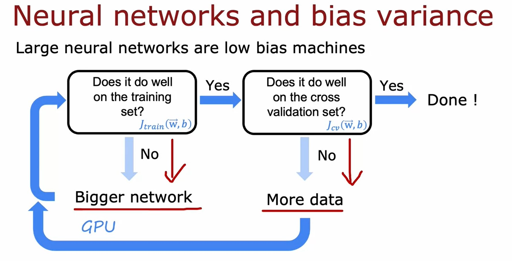
* A large neural network will usually do as well or better than a smaller one so long as regularization is chosen apporpriately.

[Lab: Diagnosing Bias and Variance](./code/C2W3_Lab_02_Diagnosing_Bias_and_Variance.ipynb)

## Machine learning development process
### Iterative loop of ML development
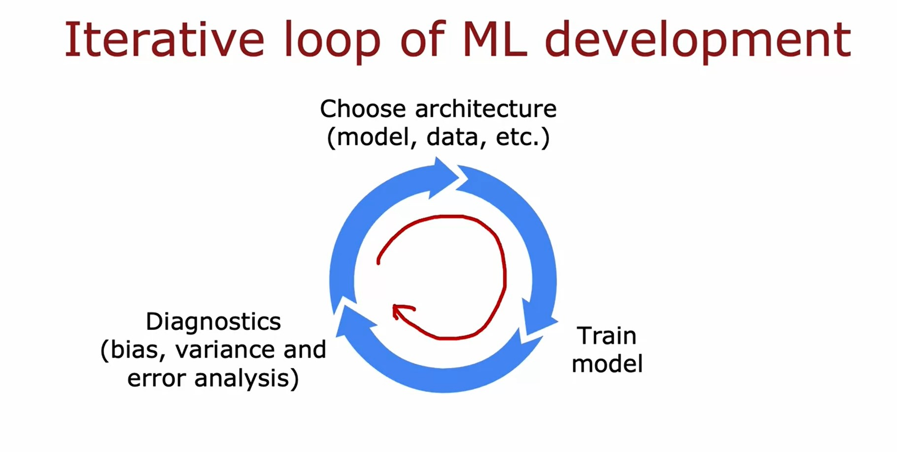
### Error analysis
* Refers to manually exmining the misclassified examples in the cross validation set and try to group them based on common traits.
    * If the number of missclassified examples is huge, we can instead look into a reasonable random sample.
* This can be useful to understand how to proceed with improving the learning algorithm.
* One limitation of the _Error Analysis_ is that it's much easier to do for problems that humans are good at.
### Adding data
* Getting more data can be slow and expensive.
* It is better to add more data of the types where [error analysis](#error-analysis) has indicated might help.
* Another techniques to increase the training data set are:
    * [Data Augmentation](#data-augmentation).
    * [Data Synthesis](#data-synthesis).
#### Data Augmentation
* **Data Augmentation**: refers to modifying an existing training example to create a new training example.
* These would be ways of taking a training example $x, y$. And applying a distortion or transformation to the input $x$ ,in order to come up with another example that has the same label $y$.
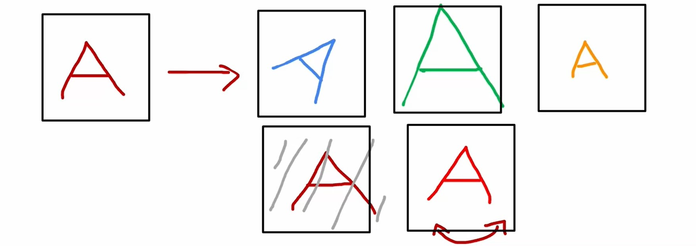
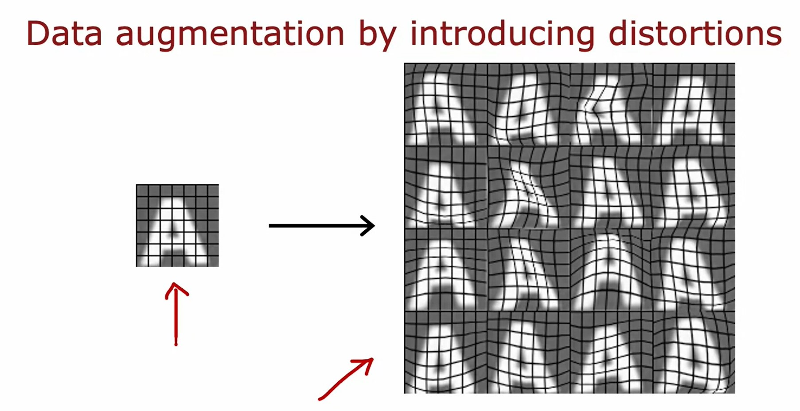
* Examples of problems that can use Data Augmentation:
    * Computer Vision.
    * Speech recognition.
> **Data Augmentation Tips**  
> * The changes or the distortions you make to the data, should be representative of the types of noise or distortions in the test set.
> * Usually doesn't help to add purely random/meaningless noise to your data.

#### Data Synthesis
* **Data Synthesis**: using artificial data inputs to create a new training example.
* Examples:
    * Artifical data synthesis for photo OCR by generating text using different fonts and resolution.
    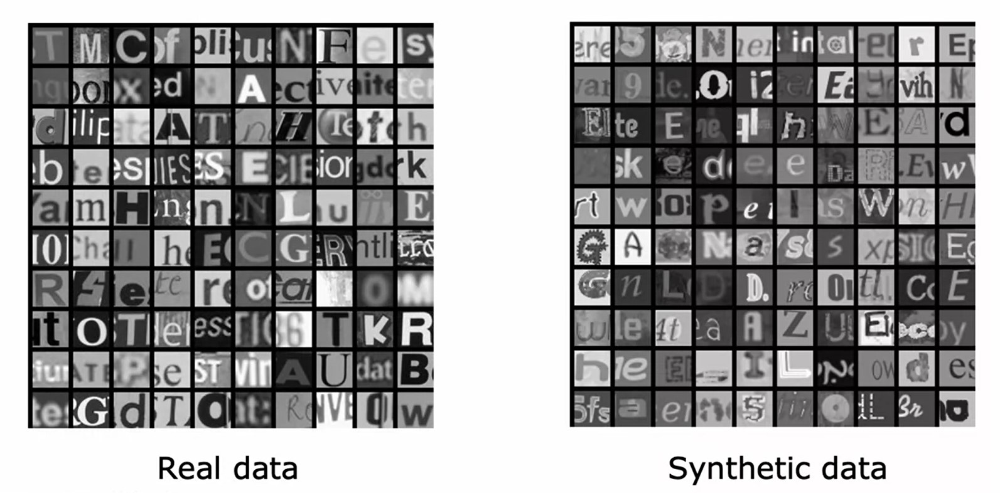
#### Engineering the data used by your system
* An AI system is:

$$
\text{AI} = \underset{\text{algorithm/model}}{\text{Code }} + \text{ Data}
$$

* Conventional **model-centric** approach:

$$
\text{AI} = \underset{\text{algorithm/model}}{\overbrace{\text{Code }}^{\text{Focus work on this}}} + \text{ Data}
$$

* **Data-centric** approach:

$$
\text{AI} = \underset{\text{algorithm/model}}{\text{Code }} + \overbrace{\text{ Data}}^{\text{Focus work on this}}
$$

### **Transfer learning**: using data from a different task
* **Transfer Learning**: is using a previously trained neural network to solve a new problem.
    * _Option 1_: Only train the output layer $\rightarrow$ works with very small data sets.
    * _Option 2_: train all parameters. In this case, the hidden layers will be intialized with the values from the initial training.
* We can consider the **Transfer Leaning** consists of 2 steps:
    1. Supervised Pretraining.
    2. Fine Tuning.

> One restriction of pre-training though, is that the image type $\mathbf{x}$ has to be the same for the pre-training and fine-tuning steps.

#### Transfer learning summary
1. Download neural network parameters pretrained on a large dataset with the same input type (e.g. images, audio, text) as your application (or train yout own).
2. Further train (fine tune) the network on your own data.

### Full cycle of a machine learning project
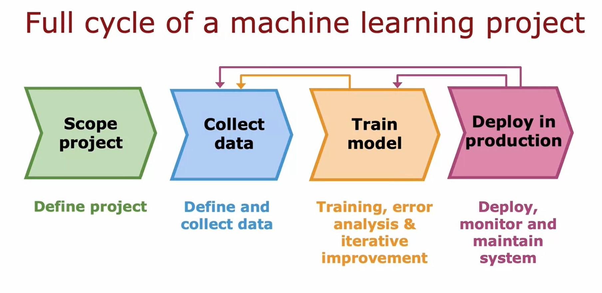
#### Deployment
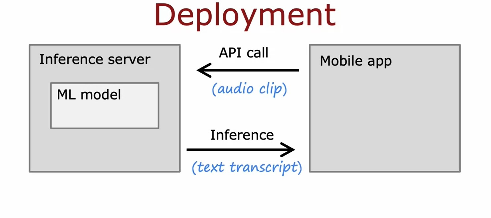
* We deploy our _Trained ML Model_ into an **Inference Server**.
* Then a **Client App** (e.g. Mobile app) can make an **API Call** to the inference server with parameter(s) $\mathbf{x}$ of the input of the _ML Model_.
* The Inference Server returns a prediction/inference $\hat{\mathbf{y}}$ to the client app.
* Software engineering may be needed for:
    * Ensure reliable and effecient predictions.
    * Scaling.
    * Logging.
    * System monitoring.
    * Model updates.

### Fairness, bias, and ethics
#### Bias
* Hiring tool that discriminates against women.
* Facial recognition system matching dark skinned individuals to criminal mugshots.
* Biased bank loans approvals.
* Toxic effect of reinforcing negative streotypes.
#### Adverse use cases
* Deepfakes.
* Spreading toxic/incendiary speech through optimizing for engagement.
* Generating fake content for commercial or political purposes.
* Using ML to build harmeful products, commits fraud etc.
    * Spam vs anti-spam.
    * Fraud vs anti-fraud.
#### Guidelines
* Get a diverse team to brainstorm things that might go wrong, with emphasis on possible harm to vulnerable groups.
* Carry out literature search on standard/guidelines for your industry.
* Audit systems against possible harm prior to deployment.
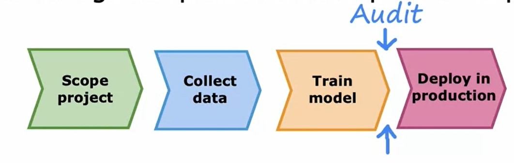
* Develop mitigation plan (if applicable), and after deployment, monitor for possible harm.
## Skewed datasets
### Error metrics for skewed datasets
* If you're working on a machine learning application where the ratio of positive to negative examples is very skewed, very far from 50-50, then it turns out that the usual error metrics like accuracy don't work that well.
* Assuming we are training a classifier $f_{\vec{\mathbf{W}},b}(\vec{\mathbf{X}})$ to predict if a patient has a disease.
    * $\mathbf{y}=1$ if the disease is present.
    * $\mathbf{y}=1$ otherwise.
    * In our test dataset, only 0.5% of patients have the disease.
    * In such case, even a dump algorithm `print("y=0")` will have less than 1% error!
* When working on problems with skewed data sets, we usually use a different error metric rather than just classification error to figure out how well our learning algorithm is doing.
* In particular, a common pair of error metrics are [precision and recall](#precisionrecall).
#### Precision/Recall
* We consider $\mathbf{y} = 1$ represents the precense or rare class we want to detect.
* We construct what's called a **Confusion Matrix**, which is a two-by-two matrix or a two-by-two table that looks like this:
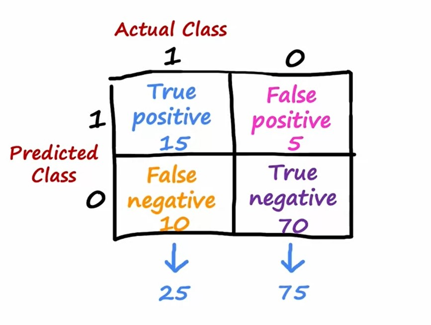
* Based on the Confusion Matrix, we can calculate the metrics as follows:
    * **Precision**: of all the patients where we predicted $\mathbf{y}=1$, what fraction actually have the rare disease?

    $$
    \frac{\text{True Positives}}{\text{\# Predicted Positives}} = \frac{\text{True Positives}}{\text{True Positives} + \text{False Positives}}
    $$

    * **Recall**: of all the patients that actually have the rare disease, what fraction did we correctly detect as having it?

    $$
    \frac{\text{True Positives}}{\text{\# Actual Positives}} = \frac{\text{True Positives}}{\text{True Positives} + \text{False Negatives}}
    $$

### Trading off precision and recall
* It turns out that in practice there's often a trade-off between precision and recall. 
* Suppose we want to predict $\mathbf{y} = 1$ (rare disease) only if very confident.
    * Higher Precision and Lower Recall.
* Suppose we want to avoid missing too many cases (rare disease) then when in doubt predict $\mathbf{y} = 1$.
    * Lower Precision and Higher Recall.
* Plotting precision and recall for different values of the threshold allows you to pick a point that you want.
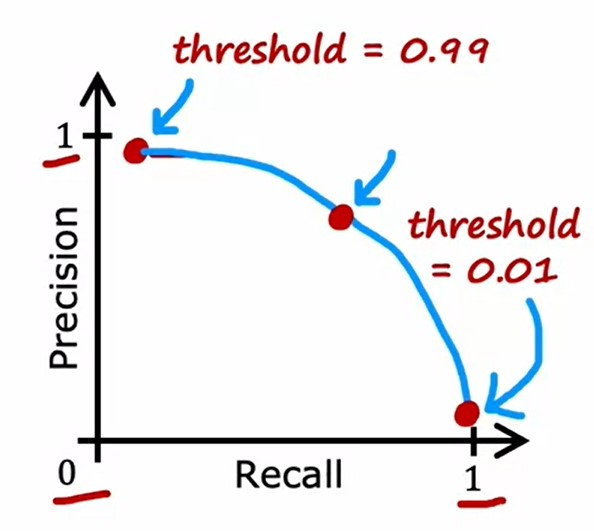
* If you want to automatically trade-off precision and recall rather than have to do so yourself, there is another metric called the [F1 score](#f1-score) that is sometimes used to automatically combine precision recall to help you pick the best value or the best trade-off between the two.
#### F1 Score
* The F1 score is a way of computing an average of sorts that pays more attention to whichever is lower.
* With _Precision_ is $P$ and _Recall_ is $R$, the formula for $F_{1} \text{ score}$ is calculated using the _Harmonic Mean_:

$$
F_{1} \text{ score} = \frac{1}{{\frac{1}{2}}\left({\frac{1}{P}} + {\frac{1}{R}} \right)} = 2 \frac{PR}{P + R}
$$

* Then we can pick the algorithm with the highest $F_{1} \text{ score}$.

[Practice Lab: Advice for Applying Machine Learning](./assignment/C2_W3_Assignment.ipynb)

[<<Previous](../week-02/README.md) | [Next>>]()