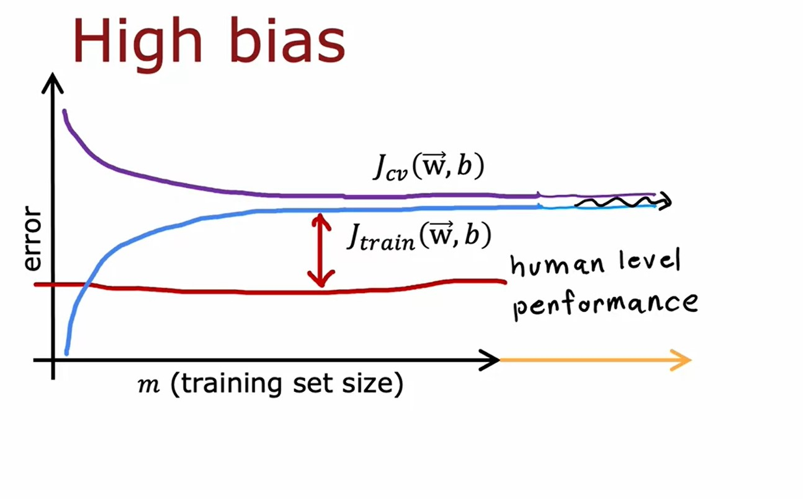

# Advice for applying machine learning
## Advice for applying machine learning
#### Debugging a learning algorithm
* Recall the regularized linear regression cost function:

$$
J(\vec{\mathbf{w}}, b) = \frac{1}{2m}\sum\limits_{i=1}^{m}{\left(f_{\vec{\mathbf{w}}, b}\left(\vec{\mathbf{x}}^{(i)}\right) - \mathbf{y}^{(i)}\right)^{2}} + \frac{\lambda}{2m} \sum\limits_{j=1}^{n}{\mathbf{w}^{2}_{j}}
$$

* If the model makes unacceptably large errors in prediction, we can try:
    * Get more training example.
    * Try smaller set of features.
    * Try getting additional features.
    * Try adding polynomial features $(x_{1}^{2}, x_{2}^{2}, x_{1}, x_{2}, \text{etc})$.
    * Try decreasing $\lambda$
    * Try increasing $\lambda$
#### Machine Learning Diagnostics
* **Diagnostic**: A test that you run to gain insight into what is/isn't working with a learning algorithm, to gain guidance into improving its performance.
### Evaluating a model
* **Overfitting**: Model fits the training data well but will fail to generalize to new examples not in the training set.
* We need some more systematic way to evaluate how well your model is doing. One technique, we can use is to split the training set into two subsets.:
    * 70% of the data to be **training set** $m_{train} = \text{No. training examples}$.
    * 30% of the data to be **testing set** $m_{test} = \text{No. test examples}$.
#### Train/test procedure for linear regression (with squared error cost)
* Fit parameters by minimizing cost function $J(\vec{\mathbf{w}},b)$ to find $\vec{\mathbf{w}},b$:

$$
J(\vec{\mathbf{w}}, b) = \frac{1}{2m_{train}}\sum\limits_{i=1}^{m_{train}}{\left(f_{\vec{\mathbf{w}}, b}\left(\vec{\mathbf{x}}^{(i)}\right) - \mathbf{y}^{(i)}\right)^{2}} + \frac{\lambda}{2m_{train}} \sum\limits_{j=1}^{n}{\mathbf{w}^{2}_{j}}
$$

* Compute test error:

$$
J_{test}(\vec{\mathbf{w}}, b) = \frac{1}{2m_{test}}\sum\limits_{i=1}^{m_{test}}{\left(f_{\vec{\mathbf{w}}, b}\left(\vec{\mathbf{x}}_{test}^{(i)}\right) - \mathbf{y}_{test}^{(i)}\right)^{2}}
$$

* Compute training error:

$$
J_{train}(\vec{\mathbf{w}}, b) = \frac{1}{2m_{train}}\sum\limits_{i=1}^{m_{train}}{\left(f_{\vec{\mathbf{w}}, b}\left(\vec{\mathbf{x}}_{train}^{(i)}\right) - \mathbf{y}_{train}^{(i)}\right)^{2}}
$$

#### Train/test procedure for classification problem
* Fit parameters by minimizing cost function $J(\vec{\mathbf{w}},b)$ to find $\vec{\mathbf{w}},b$:

$$
J(\vec{\mathbf{w}}, b) = -\frac{1}{m_{train}}\sum\limits_{i=1}^{m_{train}}{\left[\mathbf{y}^{(i)} \log \left(f_{\vec{\mathbf{w}}, b}\left(\vec{\mathbf{x}}^{(i)}\right) \right) + \left(1- \mathbf{y}^{(i)} \right) \log \left(1-f_{\vec{\mathbf{w}}, b}\left(\vec{\mathbf{x}}^{(i)}\right)\right) \right]} + \frac{\lambda}{2m_{train}}\sum\limits_{j=1}^{n}{\mathbf{w}_{j}^{2}}
$$

* Compute test error:

$$
J_{test}(\vec{\mathbf{w}}, b) = -\frac{1}{m_{test}}\sum\limits_{i=1}^{m_{test}}{\left[\mathbf{y}_{test}^{(i)} \log \left(f_{\vec{\mathbf{w}}, b}\left(\vec{\mathbf{x}}_{test}^{(i)}\right) \right) + \left(1- \mathbf{y}_{test}^{(i)} \right) \log \left(1-f_{\vec{\mathbf{w}}, b}\left(\vec{\mathbf{x}}_{test}^{(i)}\right)\right) \right]}
$$

* Compute training error:

$$
J_{train}(\vec{\mathbf{w}}, b) = -\frac{1}{m_{train}}\sum\limits_{i=1}^{m_{train}}{\left[\mathbf{y}_{train}^{(i)} \log \left(f_{\vec{\mathbf{w}}, b}\left(\vec{\mathbf{x}}_{train}^{(i)}\right) \right) + \left(1- \mathbf{y}_{train}^{(i)} \right) \log \left(1-f_{\vec{\mathbf{w}}, b}\left(\vec{\mathbf{x}}_{train}^{(i)}\right)\right) \right]}
$$

### Model selection and training/cross validation/test sets
* When having multiple models to select from, using only $J_{test}(\vec{\mathbf{w}}, b)$ is likely to be an optimistic estimate of generalization error because it relies only on the test set.
* To select a model out of possible multiple models, we need to modify the procedure by splitting our data into 3 different datasets:
    * **Training Set**: $m_{train} \approx 60\%$ of the data.
    * **Cross Validation Set**: $m_{cv} \approx 20\%$ of the data. Other names of this data set:
        * _Validation Set_.
        * _Development Set_.
        * _Dev Set_.
    * **Test Set**: $m_{train} \approx 20\%$ of the data.
* So to select a model, this can be done based on the Cross Validation error $J_{cv}(\vec{\mathbf{w}}, b)$.
* To estimate generalization error, this can be done using the Test error $J_{test}(\vec{\mathbf{w}}, b)$

[Lab: Model Evaluation and Selection](./code/C2W3_Lab_01_Model_Evaluation_and_Selection.ipynb)

## Bias and variance
### Diagnosing bias and variance

* **High Bias**: Underfit
    * $J_{traing}$ is high.
    * $J_{cv}$ is high. $J_{traing} \approx J_{cv}$
* **High Variance**: Overfit
    * $J_{traing}$ is/maybe low.
    * $J_{cv}$ is high. $J_{cv} >> J_{traing}$
* **Just Right**:
    * $J_{traing}$ is low.
    * $J_{cv}$ is low.

It rarely happens but for some reason a model can have **high bias and high variance** where $J_{train}$ will be high and $J_{cv} >> J_{train}$

### Regularization and bias/variance
* Recall Linear Regression model:

$$
\begin{align*}
f_{\vec{\mathbf{w}},b}(x) & = \mathbf{w}_{1}x + \mathbf{w}_{2}x^{2} + \mathbf{w}_{3}x^{3} + \mathbf{w}_{4}x^{4} + b \newline
J(\vec{\mathbf{w}},b) & = \frac{1}{2m} \sum\limits_{i=1}^{m}{ \left(f_{\vec{\mathbf{w}},b}\left(\vec{\mathbf{x}}^{(i)}\right) - \mathbf{y}^{(i)} \right)^{2} } + \frac{\lambda}{2m} \sum\limits_{j=1}^{n}{\mathbf{w}_{j}^{2}}
\end{align*}
$$

* Large $\lambda \implies$ High bias (underfit)
    * $\lambda = 10,000 \implies \mathbf{w}_{1} \approx 0, \mathbf{w}_{2} \approx 0 \implies f_{\vec{\mathbf{w}},b}(\vec{\mathbf{X}}) \approx 0$
    * $J_{train}(\vec{\mathbf{w}},b)$ is large
* Small $\lambda \implies$ High variance (Overfit)
    * $\lambda = 0 \implies$ no regularization.
    * $J_{train}(\vec{\mathbf{w}},b)$ is small but $J_{cv}(\vec{\mathbf{w}},b)$ is large.
* To select the best value for $\lambda$, we will use an approach similar to one used in [Model selection and training/cross validation/test sets](#model-selection-and-trainingcross-validationtest-sets)

### Establishing a baseline level of performance
What is the level of error you can reasonably hope to get to?
* Human level performance.
* Competing algorithms performance.
* Guess based on experience.

### Learning curves
Learning curves are a way to help understand how a learning algorithm is doing as a function of the amount of experience it has, whereby experience, we mean, for example, the number of training examples it has.
* As $m_{train}$, the training set size gets bigger, then you learn a better model and so the cross-validation error goes down.
* As the training set gets bigger, the training error increases because it's harder to fit all of the training examples perfectly.

#### High Bias
* If a learning algorithm suffers from high bias, getting more training data will not (by itself) help much.

#### High Variance
* If a learning algorithm suffers from high variance, getting more training data is likely to help.

### Deciding what to try next revisited

$$
J(\vec{\mathbf{w}},b) = \frac{1}{2m} \sum\limits_{i=1}^{m}{ \left(f_{\vec{\mathbf{w}},b}\left(\vec{\mathbf{x}}^{(i)}\right) - \mathbf{y}^{(i)} \right)^{2} } + \frac{\lambda}{2m} \sum\limits_{j=1}^{n}{\mathbf{w}_{j}^{2}}
$$

If the results of regularized linear regression makes large errors in prediction:
Action | Fixes
-------|------
Get more training example | High variance
Try smaller set of features | High Variance
Try increasing $\lambda$ | High Variance
Try getting additional features | High Bias
Try adding polynomial features | High Bias
Try decreasing $\lambda$ | High Bias

### Bias/variance and neural networks
* Typically there is a tradeoff between:
    * Simple model $\rightarrow$ High Bias.
    * Complex model $\rightarrow$ High Variance.
* Large neural networks when trained on small term moderate sized datasets are low bias machines.

* A large neural network will usually do as well or better than a smaller one so long as regularization is chosen apporpriately.

[Lab: Diagnosing Bias and Variance](./code/C2W3_Lab_02_Diagnosing_Bias_and_Variance.ipynb)

[<<Previous](../week-02/README.md) | [Next>>]()