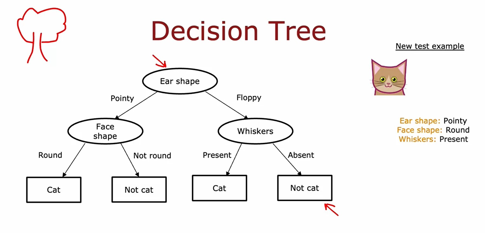
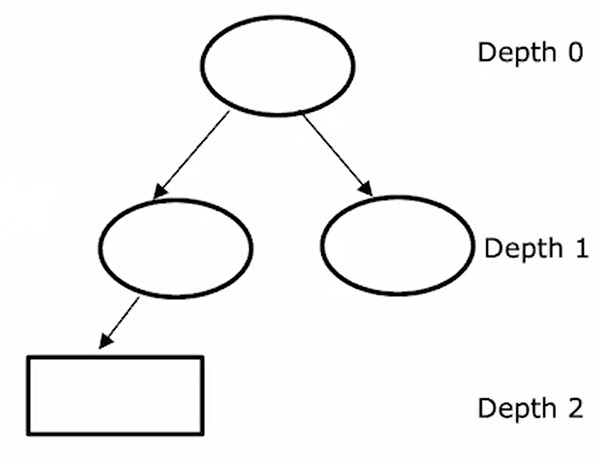
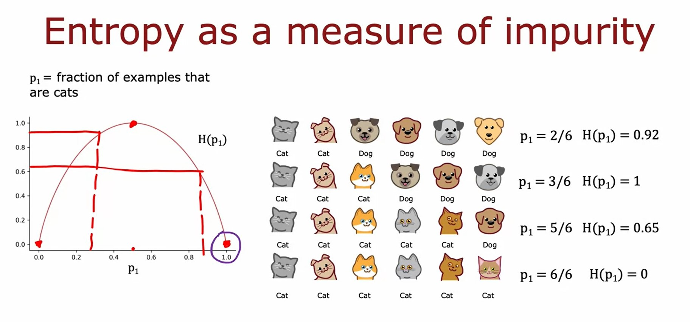
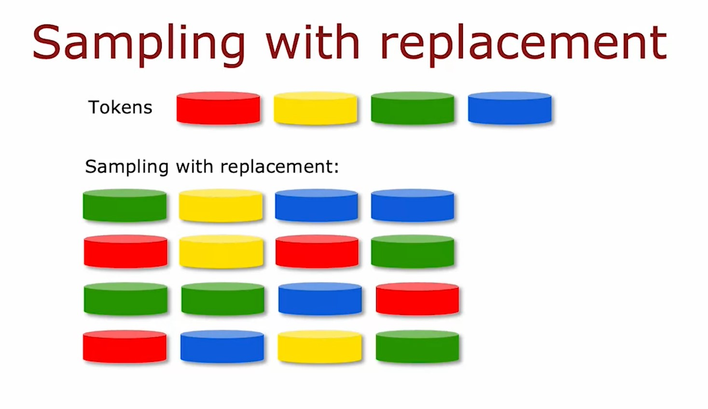

# Decision trees
## Decision trees
### Decision tree model

* The above is an example diagram of a Decision Tree.
* Every _oval_ or _rectangular_ is called a **node**.
    * The topmost first node of the tree is called **root node**.
    * All other nodes (_oval_) in the tress excluding the last level are called **decision nodes**.
    * The last nodes in the tree (_rectangular_) are called **leaf nodes**.
* The way this model works with each text example is as follows:
    * It start with the **root node** and based on the corresponding feature value in the test example, it will decide to go left or right branch in the tree.
    * Then to go down the tree and check the corresponding feature against the **decision node** and decides to go left ot right branch.
    * When it reaches the **leaf node**, it will infer a classification for the test example.

### Learning Process
* Through the process of building decision tree, there were a couple of key decisions that we had to make at various steps during the algorithm.
    1. How to choose what features to split on at each node?
        * Decision trees will choose what feature to split on in order to try to **maximize purity**. 
        * By **purity**, we mean in our example, you want to get to what subsets, which are as close as possible to all cats or all dogs.
    2. When do you stop splitting?
        * When a node is 100% one class.
        * When splitting a node will result in the tree exceeding a maximum depth.
            * One reason you might want to limit the depth of the decision tree is to make sure for us to tree doesn't get too big and unwieldy 
            * And second, by keeping the tree small, it makes it less prone to overfitting.
        
        * When improvements in purity score are below a threshold.
        * When a number of examples in a node is below a threshold.
## Decision tree learning
### Measuring purity
* Let's assume $p_{1}$ = fraction of examples that are $\mathbf{y} = 1$
* We will introduce the Entropy function $H(p_{1})$ as a measure of impurity.

* Formula for the entropy function $H(p_{1})$:

$$
\begin{align*}
p_{1} & = \text{fraction of examples that are } \mathbf{y} = 1 \newline
p_{0} & = 1 - p{1} \newline
H(p_{1}) & = -p_{1} \log_{2}(p_{1}) - p_{0} \log_{2}(p_{0}) \newline
& = -p_{1} \log_{2}(p_{1}) - (1-p_{1})\log{2}(1-p_{1})
\end{align*}
$$

### Choosing a split: Information Gain
* When building a decision tree, the way we'll decide what feature to split on at a node will be based on what choice of feature reduces entropy the most (Reduces entropy, reduces impurity or maximizes purity).
* In decision tree learning, the reduction of entropy is called **Information Gain**.
* When choosing a feature to use to split in a node, we edn up with 2 sub-branches.
* Associated with each of these splits is two numbers, the entropy on the left sub-branch and the entropy on the right sub-branch.
* The way we're going to combine these two numbers is by taking a weighted average.
    * Because how important it is to have low entropy in, say, the left or right sub-branch also depends on how many examples went into the left or right sub-branch.
    * If there are lots of examples in, say, the left sub-branch then it seems more important to make sure that that left sub-branch's entropy value is low.
* To follow the convection in decision trees, rather than computing this weighted average entropy, we're going to compute the reduction in entropy compared to if we hadn't split at all which is **Information Gain**.

$$
\text{Information Gain} = H({p_{1}}^{\text{root}}) - \left(w^{\text{left}} H({p_{1}}^{\text{left}}) + w^{\text{right}} H({p_{1}}^{\text{right}}) \right)
$$

> **Why use Information Gain instead of Entropy?**  
> one of the stopping criteria for deciding when to not bother to split any further is if the reduction in entropy is too small. In which case you could decide, you're just increasing the size of the tree unnecessarily and risking overfitting by splitting and just decide to not bother if the reduction in entropy is too small or below a threshold.

### Putting it together
#### Decision Tree Learning
* Start with all examples at the root node.
* Calculate the information gain for all possible features, and pick one with the highest information gain.
* Split dataset according to selected feature, and create left and right branches of the tree.
* Keep repeating splitting process until stopping criteria is met:
    * When node is 100% one class.
    * When splitting a node will result in the tree exceeding a maximum depth.
    * Information gain from additional splits is less than threshold.
    * When a number of examples in a node is below a threshold.
* Implementing a decision tree utilize Recursion.
> **Recursion**  
> Recursion in computer science refers to writing code that calls itself.

### Using one-hot encoding of categorical features
* **One-Hot Encoding** is used with features that can take on more than two values.
> **One-Hot Encoding**  
> If a categorical feature can take on $k$ possible values then we will replace it by creating $k$ binary features that can only take on the values $0$ or $1$.
* **One-Hot Encoding** is also useful applying neural networks on categorical features.
### Continuous valued features
* To get the decision tree to work on continuous value features at every node. When consuming splits:
    * You would just consider different values to split on.
    * Carry out the usual information gain calculation.
    * Decide to split on that continuous value feature if it gives the highest possible information gain.

### Regression Trees
* We'll generalize decision trees to be regression algorithms so that we can predict a number.
* When building a regression tree, rather than trying to reduce [entropy](#measuring-purity), which was that measure of impurity that we had for a classification problem, we instead try to reduce the _variance of the weight_ of the values $Y$ at each of these subsets of the data.
#### Choosing a split
* A good way to choose a split would be to just choose the value of the weighted variance that is lowest.
* For a regression tree we'll measure the reduction in variance.

[Lab: Decision Trees](./code/C2_W4_Lab_01_Decision_Trees.ipynb)

## Tree ensembles
### Using multiple decision trees
* One of the weaknesses of using a single decision tree is that that decision tree can be highly sensitive to small changes in the data.
* One solution to make the algorithm less sensitive or more robust is to build not one decision tree, but to build a lot of decision trees, and we call that a **Tree Ensemble**.
* If you had a new test example that you wanted to classify, then what you would do is run all three of these trees on your new example and get them to vote on whether it's the final prediction.
### Sampling with replacement
* In order to build a tree ensemble, we're going to need a technique called **Sampling with Replacement**.
    * The term with replacement means that if I take out the next token, I'm going to take this, and put it back in, and shake it up again, and then take on another one. 
    * Replace it. That's a little replacement part. 
    * Then go again.


>**Note**  
>Notice that the with replacement part of this is critical because if I were not replacing a token every time I sample, then if I were to pour four tokens from my bag of four, I will always just get the same four tokens.
* The way that sampling with replacement applies to building an ensemble of trees is as follows:
    * We are going to construct multiple random training sets that are all slightly different from our original training set. 
    * We're going to create a new random training set of 10 examples of the exact same size as the original data set.
    * We get another repeats the example, and so on and so forth. Until eventually you end up with 10 training examples, some of which are repeats.
* The process of sampling with replacement, lets you construct a new training set that's a little bit similar to, but also pretty different from your original training set.
* This would be the key building block for building an ensemble of trees. 
### Random forest algorithm
#### Generating a tree sample: Bagged decision tree
* Given training set of size $m$
* For $b=1$ to $B$:
    * Use sampling with replacement to create a new training set of size $m$.
    * Train a decision tree on the new dataset.
* This specific instance creation of tree ensemble is sometimes also called a **Bagged decision tree**.
>**Notes**:  
>* Typical choice of $B$ the number of such trees you build is around 100.
>    * People recommend any value from 64 to 228.
>* Setting $B$ to be larger, never hurts performance, but beyond a certain point, you end up with diminishing returns and it doesn't actually get that much better when $B$ is much larger than say 100 or so.
#### Random forest
* The key idea is that even with this [sampling with replacement procedure](#generating-a-tree-sample-bagged-decision-tree) sometimes you end up with always using the same split at the root node and very similar splits near the root note. 
* There's one modification to the algorithm to further try to randomize the feature choice at each node that can cause the set of trees you learn to become more different from each other.
* At each node, when choosing a feature to use to split:
    * If $n$ features are available, pick a random subset of $k$ features where $k < n$ .
    * Allow the algorithm to only choose from that subset of features $k$.

> **Note**  
> When $n$ is large, say $n$ is dozens or 10's or even hundreds. A typical choice for the value of $k$ would be to choose it to be square root of $n$: $k = \sqrt{n}$
### XGBoost
* _XGBoost_ is by far the most commonly used way or implementation of decision tree ensembles or decision trees.
    * It runs quickly
    * The open source implementations are easily used
    * It has also been used very successfully to win many machine learning competitions as well as in many commercial applications.
#### Boosted trees intution
* Given training set of size $m$
* For $b=1$ to $B$:
    * Use sampling with replacement to create a new training set of size $m$.
        * Instead of picking from all examples with equal ($^1/_m$) probability, make it more likely to pick misclassified examples from previously trained trees.
    * Train a decision tree on the new dataset.
#### XGBoost (eXtreme Gradient Boosting)
* Open source implementation of boosted trees.
* Fast effecient implementation.
* Good choice of default splitting criteria and criteria for when to stop splitting.
* Built in regularization to prevent overfitting.
* Highly competitive algorithm for machine learning competitions.

#### Using XGBoost
* Classification
    ```python
    from xgboost import XGBClassifier

    model = XGBClassifier()

    model.fit(X_train, Y_train)
    y_pred = model.predict(X_test)
    ```
* Regression
    ```python
    from xgboost import XGBRegressor

    model = XGBRegressor()

    model.fit(X_train, Y_train)
    y_pred = model.predict(X_test)
    ```
### When to use Decision Trees vs Neural Network
#### Decision Trees and Tree Ensembles
* Work well on tabular (structured) data.
* Not recomended for unstructured data (images, audio, text)
* Fast to train.
* Small decision trees may be human interpretable.  
    > XGBoost is recomended for most of the applications

#### Neural Networks
* Works well on types of data, including tabular (structured) and unstructured data.
* May be slower than a decision tree.
* Works with transfer learning.
* When building a system of multiple models working together, it might be easier to string together multiple neural networks.

[Lab: Tree Ensembles](./code/C2_W4_Lab_02_Tree_Ensemble.ipynb)
----------
[Assignment: Practice Lab: Decision Trees](./assignment/C2_W4_Decision_Tree_with_Markdown.ipynb)

[<<Previous](../week-03/README.md) | [Next>>]()