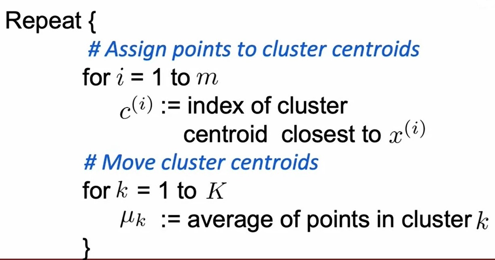
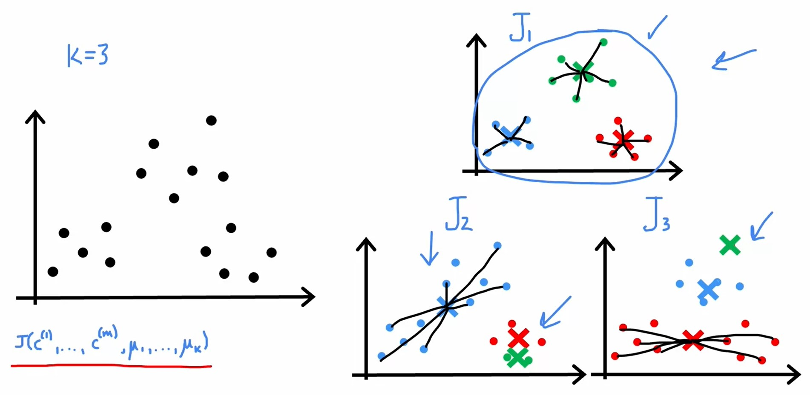
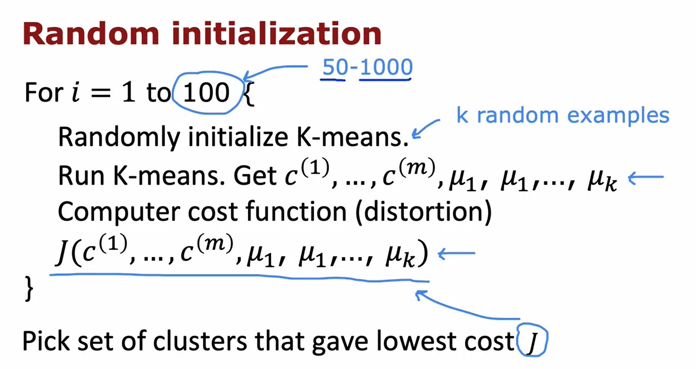
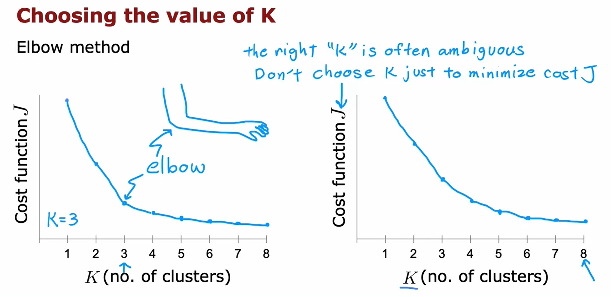
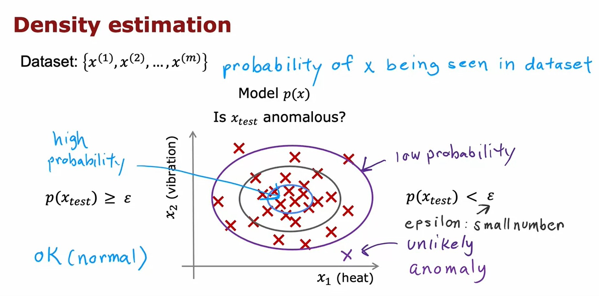
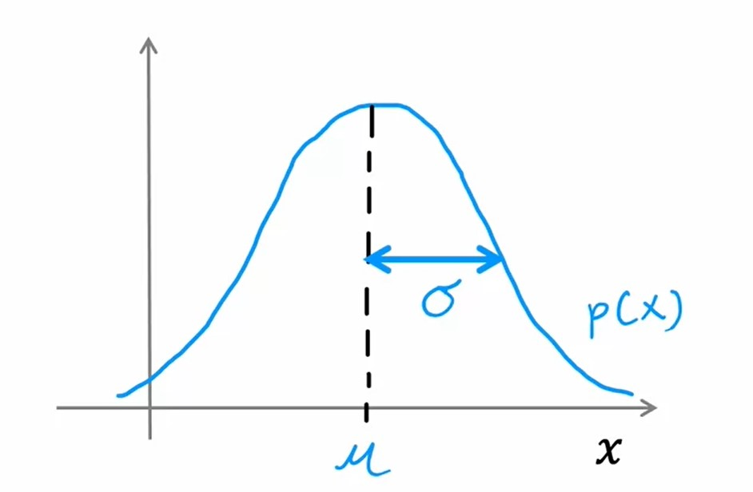
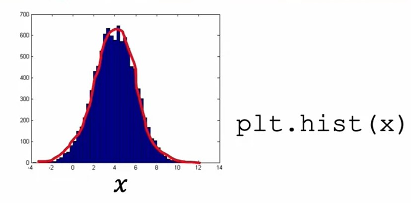
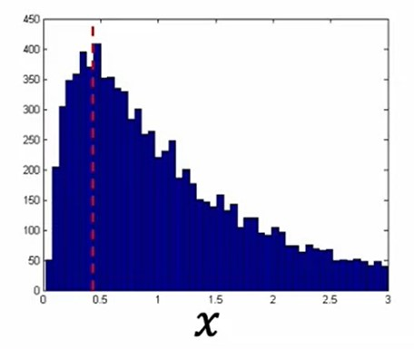

# Unsupervised learning
## Clustering
### What is clustering?
* A clustering algorithm looks at a number of data points and automatically finds data points that are related or similar to each other.
* Clustering is an **unsupervised learning** algorithm
    * In _supervised learning_, the dataset included both the inputs $\mathbf{x}$ as well as the target outputs $\mathbf{y}$.
    * In _unsupervised learning_, you are given a dataset like this with just $\mathbf{x}$, but not the labels or the target labels $\mathbf{y}$.
    * Because we don't have target labels $\mathbf{y}$, we're not able to tell the algorithm what is the **right answer**, $\mathbf{y}$ that we wanted to predict.
    * Instead, we're going to ask the algorithm to find something interesting about the data, that is to find some interesting structure about this data. 
#### Applications of clustering
* Grouping simalar news.
* Market segmentation.
* DNA Analysis.
* Astronomical data analysis.
### K-means intuition
* K-means is a clustering algorithm.
* Initially K-means starts by taking a random guess at where might be the centers of the two clusters that you might ask it to find.
    > **Centriods**: the centers of the cluster are called cluster _Centroids_.
* After it has made an initial guess at where the cluster centroid is, it will go through all of data points.
    * And for each of them it will check which centroid is closer to this data point.
    * And it will assign each of these points to whichever of the cluster centroids It is closer to.
    * It will move each centroid to whatever is the average location of the data points associated with it.
* K-means will repeatedly do two different things:
    1. The first is assign points to cluster centroids.
    2. The second is move cluster centroids.
### K-means algorithm
* Randomly initialize $K$ cluster centroids $\mu_{1}, \mu_{2}, \dots, \mu_{K}$.
* Repeat:
    * Assign points to cluster centroids
    * Move cluster centroids

    > **Corner Case** if a cluster has zero training examples assigned to it. In that case, the second step, $\mu_{K}$, would be trying to compute the average of zero points which is not defined.  
    > The most common thing to do is to just eliminate that cluster. You end up with $K - 1$ clusters.  
    > Alternatively, we can randomly reinitialize that cluster centroid and hope that it gets assigned at least some points next time round.
### Optimization objective
> **Notations**  
> * $c^{(i)} = \text{index of cluster } (1, 2, \dots , K) \text{ to which example } x^{(i)} \text{ is currently assigned}$
> * $\mu_{k} = \text{Cluster centroid } k$
> * $\mu_{c^{(i)}} = \text{Cluster centroid of cluster to which example } x^{(i)} \text{has been assigned}$

#### Cost Function
$$
J(c^{(1)}, \dots , c^{(m)}, \mu_{1}, \dots, \mu_{K}) = \frac{1}{m} \sum\limits_{i=1}^{m}{\left\| x^{(i)} - \mu_{c^{(i)}} \right\|}^{2}
$$

> In some context, the above formula is called **Distortion Function**.

### Initializing K-means
#### Random Initialization
* Random Initialization steps:
    1. First choose $K < m$.
    2. Randomly pick $K$ training examples.
    3. Set $\mu_{1}, \mu_{2}, \dots , \mu_{K}$ equal to this $K$ examples.
* Depending on how you choose the random initial centroids, K-means will end up picking a difference set of centroids for your data set.
    * With less fortunate choice of random initialization, it can happen to get stuck in a local minimum.

* To give K-means multiple shots at finding the best local optimum, One other thing you could do with the K-means algorithm is to run it multiple times and then to try to find the best local optima.
* If you were to run K-means 3 times say, then one way to choose between these 3 solutions, is to compute the cost function $J$ for all 3 of these solutions. And then to pick the one which gives you the lowest value for the cost function $J$.

### Choosing the number of clusters
* The K-means algorithm requires as one of its inputs, $K$, the number of clusters you want it to find.
#### What is the right value of $K$?
* For a lot of clustering problems, the right value of $K$ is truly ambiguous.
* Because clustering is unsupervised learning algorithm you're not given the _right answers_ in the form of specific labels to try to replicate.
* There are lots of applications where the data itself does not give a clear indicator for how many clusters there are in it.
#### Choosing the value of $K$
* The right value of $K$ is truly ambiguous but in some applications, it is possible to use the [Elbow method](#elbow-method)
* [Elbow method](#elbow-method) is not always optimal so it is recomended to evaluate K-means based on how well it performs for later purposes.
##### Elbow Method

* In this method:
    1. You would run K-means with a variety of values of $K$
    2. Plot the cost function $J$ as a function of the number of clusters.

[Assignment Lab: k-means](./assignment-kmeans/C3_W1_KMeans_Assignment.ipynb)

----------

## Anomaly detection
### Finding unusual events
* **Anomaly detection** algorithms look at an unlabeled dataset of normal events and thereby learns to detect or to raise a red flag for if there is an unusual or an anomalous event.
#### Density Estimation

* What _Density Estimation_ means is, when you're given your training sets of these $m$ examples
    1. Build a model for the probability of $X$.
        * The learning algorithm will try to figure out what are the values of the features $x_1$ and $x_2$ that have high probability and what are the values that are less likely or have a lower chance or lower probability of being seen in the data set. 
    2. compute the probability of $X_{test}$.
        * If the $p(x_{test})$ is less than some small threshold or some small number $\epsilon$, we will raise a flag to say that this could be an anomaly.
#### Anomaly Detecion examples
* _Fraud detecion_: Indentify unusual users by checking which have $p(x) < \epsilon$.
* _Manufacturing_: For quality assurance.
* _Monitoring_ computers in a data center:
### Gaussian (normal) distribution
Say $x$ is a number.  
Probability of $x$ is determined by a Gaussian with mean $\mu$, variance $\sigma^{2}$  

$$
\begin{align*}
p(x) & = \frac{1}{\sqrt{2\pi} \sigma}  e^\frac{-(x-\mu)^{2}}{2 \sigma^{2}} \newline
\text{Where: } \quad \mu & = \frac{1}{m} \sum\limits_{i=1}^{m}{x^{(i)}} \newline
\sigma^{2} & = \frac{1}{m} \sum\limits_{i=1}^{m}{(x^{(i)} - \mu)^{2}}
\end{align*}
$$

### Anomaly detection algorithm
#### Density Estimation
* Training set: $\left\{\ {\vec{\mathbf{x}}}^{(1)}, {\vec{\mathbf{x}}}^{(2)}, \dots , {\vec{\mathbf{x}}}^{(m)} \right\}$
* Each example ${\vec{\mathbf{x}}}^{(i)}$ has $n$ features.
* We will build a model or estimate the probability for $p(x)$ which is going to be as follows:
    * ${\vec{\mathbf{x}}}$ is a feature vector ${\vec{\mathbf{x}}}^{(i)} = \begin{bmatrix} x_{1} \\ x_{2} \\ \vdots \\ x_{n} \end{bmatrix}$.
    * The model for $p(\vec{\mathbf{x}})$ is going to be:

$$
\begin{align*}
p(\vec{\mathbf{x}}) & = p(x_{1};\mu_{1};{\sigma_{1}}^{2}) * p(x_{2};\mu_{2};{\sigma_{2}}^{2}) * p(x_{3};\mu_{3};{\sigma_{3}}^{2}) * \cdots * * p(x_{n};\mu_{n};{\sigma_{j}}^{n}) \newline
& = \prod\limits_{j=1}^{n}{p(x_{j}; \mu_{j}; {\sigma_{j}}^{2})}
\end{align*}
$$

#### Anomaly detection algorithm
1. Choose $n$ features $x_{i}$ that you think might be indicative of anamolous examples.
2. Fit parameters $\mu_{1}, \cdots , \mu_{n}, {\sigma_{1}}^{2}, \cdots , {\sigma_{n}}^{2}$
3. Given new example $x$, compute $p(x)$:

$$
\begin{align*}
p(\mathbf{x}) & = \prod\limits_{j=1}^{n}{p(x_{j}; \mu_{j}; {\sigma_{j}}^{2})} \newline
& = \prod\limits_{j=1}^{n}{ \frac{1}{\sqrt{2\pi} \sigma_{j}} e^{(-\frac{(x_{j} - \mu_{j})}{2 {\sigma_{j}^{2}}})} } \\
& \boxed{\text{Anomaly if } p(x) < \epsilon}
\end{align*}
$$

### Developing and evaluating an anomaly detection system
* When developing a learning algorithm (choosing feature, etc), making decisions is much easier if we have a way of evaluating our learning algorithm.
* While anomaly detection is unsupervised algorithm, it is still useful to have some labeled data, of anomalous and non-anomalous examples.
    * Anomalous labels will have $\mathbf{y}=1$.
    * Non-anomalous labels will have $\mathbf{y}=0$.
* Training set: ${\mathbf{x}}^{(1)}, {\mathbf{x}}^{(2)}, \cdots , {\mathbf{x}}^{(m)}$ (Assume all are normal examples/not anomalous).
* To evaluate the algorithm, come up with a way to have a small number of anomalous examples so we can create cross validation set and test set.

$$
\begin{align*}
\text{Cross validation set: }&  \left( x_{cv}^{(1)}, y_{cv}^{(1)} \right), \dots , \left( x_{cv}^{(m_{cv})}, y_{cv}^{(m_{cv})} \right) \newline
\text{Test set: } & \left( x_{test}^{(1)}, y_{test}^{(1)} \right), \dots , \left( x_{test}^{(m_{test})}, y_{test}^{(m_{test})} \right)
\end{align*}
$$

### Anomaly detection vs. supervised learning
Anomaly detection | Supervised learning
------------------|--------------------
Very small number of positive examples ($\mathbf{y}=1$). (0-20 is common).  Large number of negative ($\mathbf{y}=0$) examples. | Large number of positive and negative examples.
Many different **types** of anomalies. Hard for any algorithm to learn from positive examples what the anomalies look like; future anomalies may look nothing like any of the anomalous examples we've seen so far. | Enough positive examples for algorithm to get a sense of what positive examples are like, future positive examples likely to be similar to ones in training set.
Financial Fraud Detection Manufacturing - Finding new previously unseen defects in manufacturing (e.g. aircraft engines) Monitoring machine in a data center | Email spam classification Manufacturing - Finding known, previously seen defects. Weather prediction (sunny/rainy/etc) Disease Classification

### Choosing what features to use
* In Supervised Learning, if you don't have the features quite right, or if you have a few extra features that are not relevant to the problem, that often turns out to be okay.
    * Because the algorithm has the supervised signal that is enough labels why for the algorithm to figure out what features ignore, or how to re scale feature and to take the best advantage of the features you do give it.
* For anomaly detection which runs, or learns just from unlabeled data, is harder for the anomaly to figure out what features to ignore.
* Carefully choosing the features, is even more important for anomaly detection, than for supervised learning approaches.
#### Non-gaussian features
* Try to make sure the features you give to the anomay detection are more or less Gaussian.
    * If your features are not Gaussian, sometimes you can change it to make it a little bit more Gaussian.
##### Example
* If you have a feature $x_{1}$, we often plot its histogram `plt.hist(x_1)`

* It can happen that the histogram of another feature $x_{2}$ is non-gaussian.

    * In that case, we can try to transform $x_{2}$ in order to make it gaussian. Examples:
        * $x \rightarrow \log(x)$
        * $x \rightarrow \log(x + c)$
        * $x \rightarrow \sqrt{x} \rightarrow x^{^1/_2}$
        * $x \rightarrow \sqrt[3]{x} \rightarrow x^{^1/_3}$
    > **Important**: Whatever transformation you apply to the training set, please remember to apply the same transformation to your cross validation and test set data as well.
* [Code example of transformation](./code/gaussian-transformation.ipynb)
#### Error analysis for anomaly detection
* You can also carry out an error analysis process for anomaly detection, to understand why your anomaly detection doesn't work:
    * What we want is:
        * $p(x) \geq \epsilon$ large for normal examples $x$.
        * $p(x) \leq \epsilon$ small for anomalous examples $x$.
    * Most common problem:
        * $p(x)$ is comparable for normal and anomalous examples. ($p(x)$ is large for both)
        * In that case, what I would normally do is, try to look at that example and try to figure out what is it that made me think is an anomaly. This can lead us to find that adding another feature can distinguish anomalous behavior from normal behavior.

[Practice Assignment: Anomaly Detection](./assignment-anomaly-detection/C3_W1_Anomaly_Detection.ipynb)

[<<Previous](../README.md) | [Next>>](../week-02/README.md)