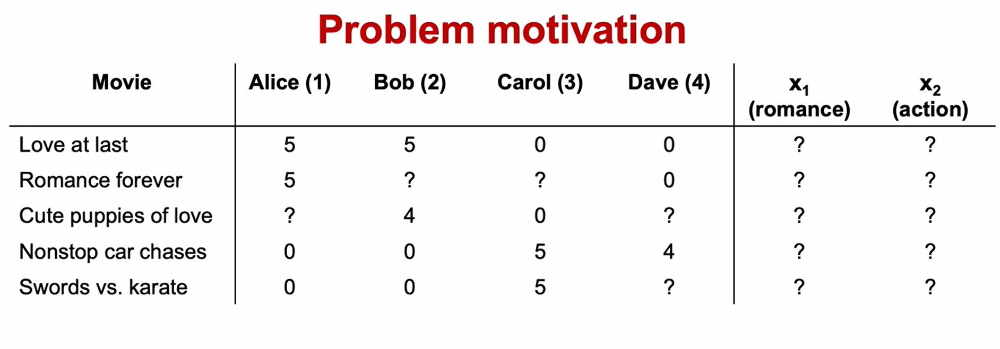
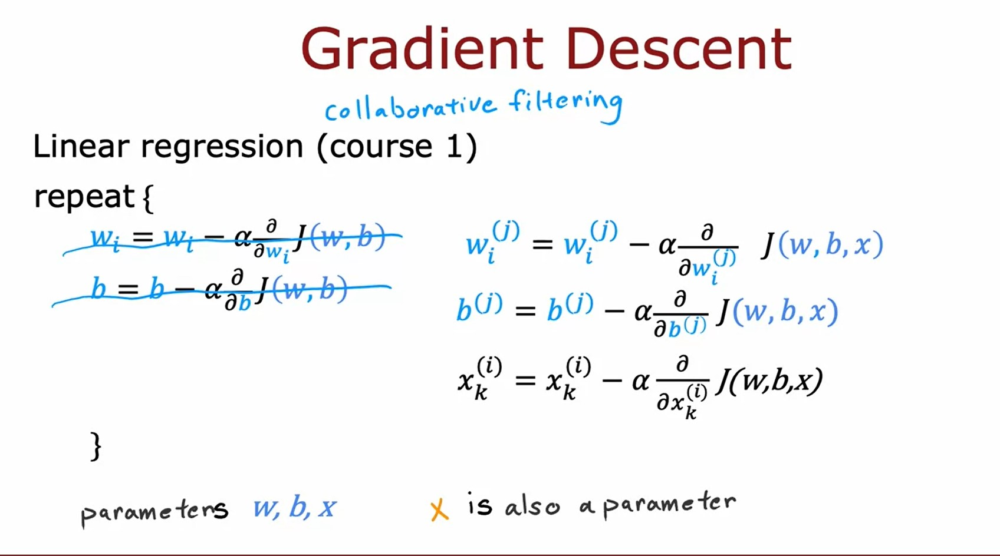
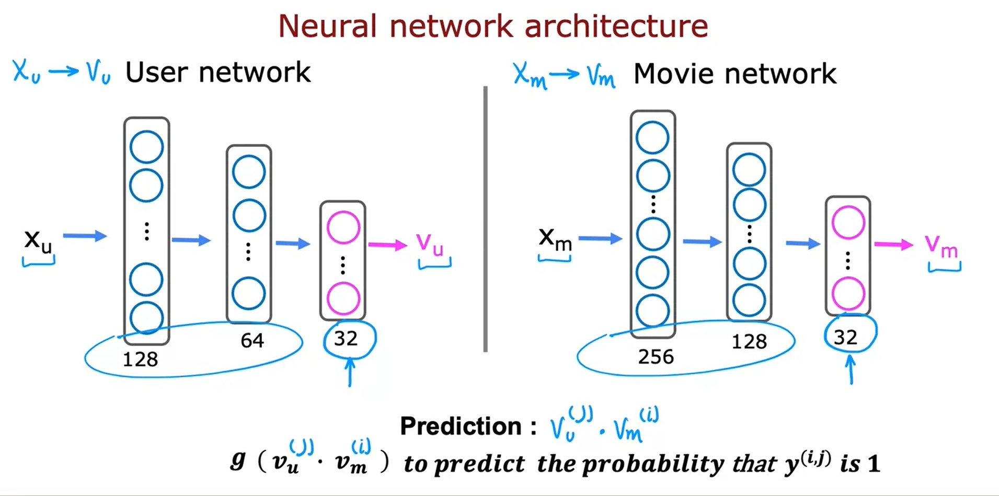
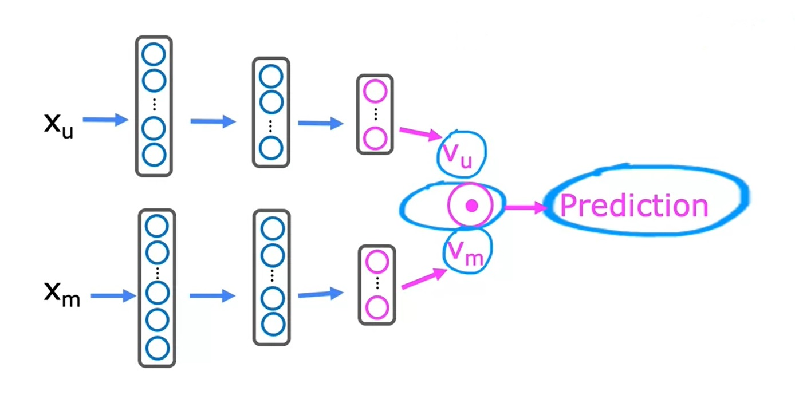
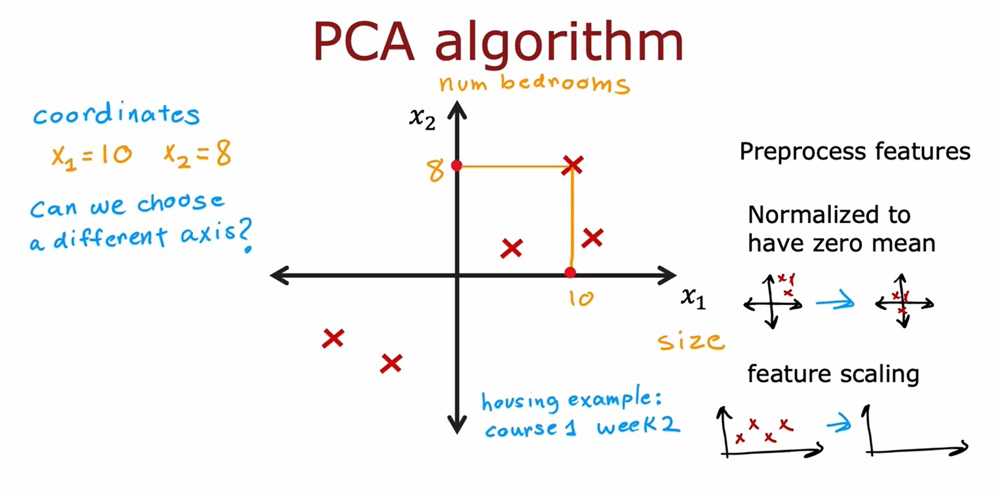
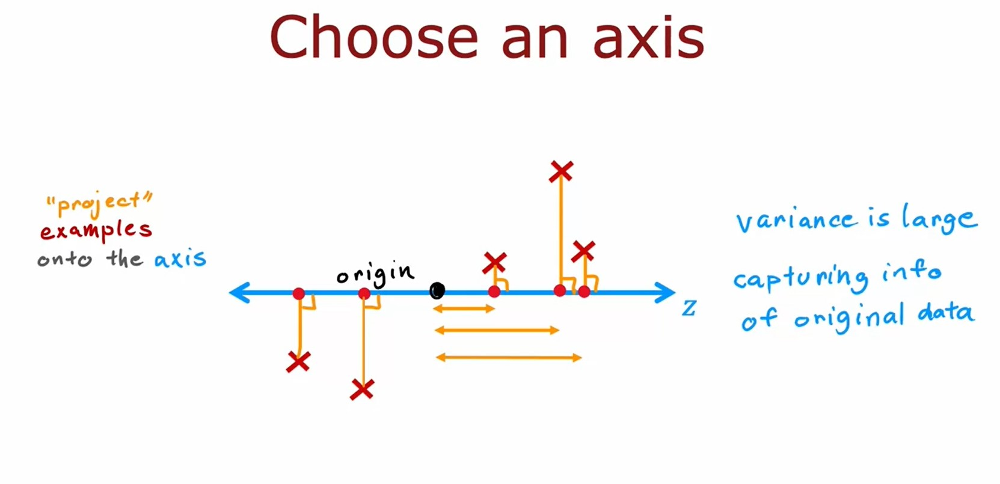
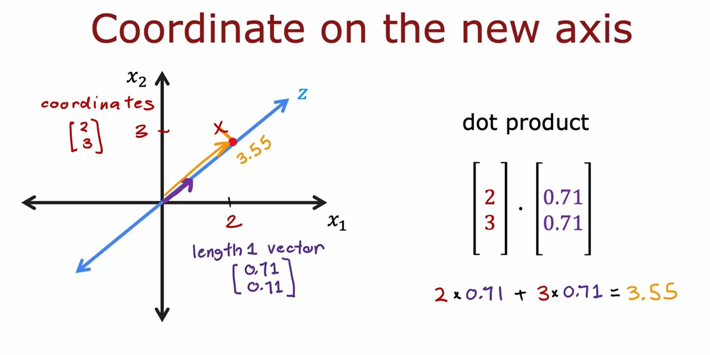
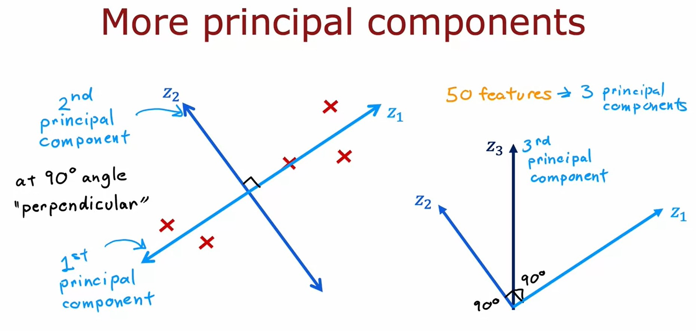
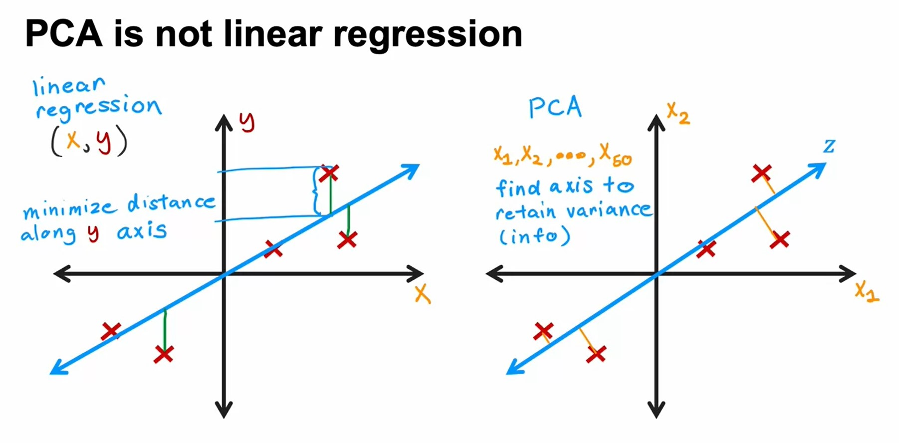
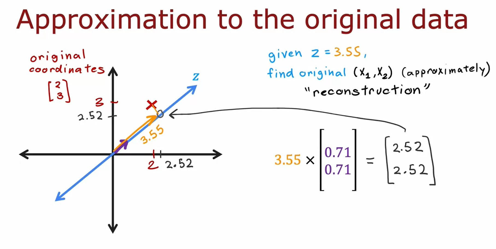

# Recommender systems
## Collaborative filtering
### Making recommendations
* In the typical recommended system, we have some number of **users** as well as some **number of items**.
* When users rate items they already used, then it is possible to predict the ratings of other items they didn't rate and hence recommend those items to them.
* The notation we use:
    * $n_{u} =$ no. of users.
    * $n_{m} =$ no. of movies.
    * $r(i, j) = 1$ if user $j$ has rated movie $i$.
    * $\mathbf{y}^{(i, j)} =$ rating given by user $j$ to movie $i$ (defined only if $r(i, j) = 1$).
### Using per-item features
* To develop our recommendations system, we will add features to the items.
    * In case of movies, we can add features related to the genre of each movie.
    * We will donate $n$ as the number of features that each items has.
* If the item has $n=2$ features then we can donate the features of the first item as $\mathbf{x}^{(1)} = \begin{bmatrix} 0.9 \newline 0 \end{bmatrix}$
* So for user 1, to predict the rating for movie $i$, we use a formula similar to _linear regression_ as: $\mathbf{w}^{(1)} \cdot \mathbf{x}^{(i)} + b^{(1)}$
* And to generalize, for user $j$ the formula would be: $\mathbf{w}^{(j)} \cdot \mathbf{x}^{(i)} + b^{(j)}$.
* The difference with _Linear Regression_ is in Recommendation system, we fit a Linear Regression model for each user in the dataset.
#### Cost Function
* Notation:
    * $r(i, j) = 1$ if user $j$ has rated movie $i$ ($0$ otherwise).
    * $\mathbf{y}^{(i, j)} =$ rating given by user $j$ to movie $i$ (if defined).
    * $\mathbf{w}^{(j)}, b^{(j)} =$ parameters for user $j$.
    * $\mathbf{x}^{(i)} =$ feature vector for movie $i$.
    * For user $j$ and movie $i$, predict rating: $\mathbf{w}^{(j)} \cdot \mathbf{x}^{(i)} + b^{(j)}$.
    * $m^{(j)} =$ no. of movies rated by user $j$.
* To learn $\mathbf{w}^{(j)}, b^{(j)}$, the cost function to minimize will be:

$$
\min_{\mathbf{w}^{(j)}, b^{(j)}} J(\mathbf{w}^{(j)}, b^{(j)}) = \frac{1}{2} \sum\limits_{i:r(i,j)=1}{ \left( \underbrace{\mathbf{w}^{(j)} \cdot \mathbf{x}^{(i)} + b^{(i)}}_{\text{Predicted rating}} - \underbrace{\mathbf{y}^{(i,j)}}_{\text{Actual rating}} \right)^{2} } + \underbrace{\frac{\lambda}{2} \sum\limits_{k=1}^{n}{ \left( \mathbf{w}_{k}^{(j)} \right)^{2} }}_{\text{Regularization term}}
$$

* To learn parameters $\mathbf{w}^{(1)}, b^{(1)}, \dots , \mathbf{w}^{(n_{u})}, b^{(n_{u})}$ for all users:

$$
\min_{\mathbf{w}^{(1)}, b^{(1)}, \dots , \mathbf{w}^{(n_{u})}, b^{(n_{u})}} J \begin{pmatrix} \mathbf{w}^{(1)}, & \dots, & \mathbf{w}^{(n_{u})} \newline b^{(1)}, & \dots, & b^{(n_{u})} \end{pmatrix} = \frac{1}{2} \sum\limits_{j=1}^{n_{u}} \sum\limits_{i:r(i,j)=1}{ \left( \mathbf{w}^{(j)} \cdot \mathbf{x}^{(i)} + b^{(i)} - \mathbf{y}^{(i,j)} \right)^{2} } + \frac{\lambda}{2} \sum\limits_{j=1}^{n_{u}} \sum\limits_{k=1}^{n}{ \left( \mathbf{w}_{k}^{(j)} \right)^{2} }
$$
### Collaborative filtering algorithm
* What if we don't have features, $x_1$ and $x_2$ of the product items?

* In collaborative filtering, because we have ratings from multiple users of the same item with the same movie, it is possible guess features $x_1$ and $x_2$ from scratch.
#### Cost Function for estimating $\mathbf{x}^{(i)}$
* Given $\mathbf{w}^{(1)}, b^{(1)}, \mathbf{w}^{(2)}, b^{(2)}, \dots , \mathbf{w}^{(n_{u})}, b^{(n_{u})}$, to learn $\mathbf{x}^{(i)}$:

$$
J\left(\mathbf{x}^{(i)}\right) = \frac{1}{2} \sum\limits_{j:r(i,j) = 1}{ \left(\underbrace{\mathbf{w}^{(j)} \cdot \mathbf{x}^{(i)} + b^{(j)}}_{\text{Predicted}} - \underbrace{\mathbf{y}^{(i,j)}}_{\text{Actual}} \right)^{2} } + \underbrace{\frac{\lambda}{2} \sum\limits_{k=1}^{n}{ \left( \mathbf{x}_{k}^{(i)} \right)^{2}} }_{\text{Regularization Term}}
$$

* So therefore all the users $j$ that have rated movie $i$, we will try to minimize the squared difference between what your choice of features $\mathbf{x}^{(i)}$ results in terms of the predicted movie rating minus the actual movie rating that the user had given it.
    * Finally, if we want to add a regularization term, we add the usual $+ \frac{\lambda}{2}$, $k= 1$ through $n$, where $n$ as usual is the number of features of $\mathbf{x}^{(i)}$ squared.

* To learn all the features in our data set $\mathbf{x}^{(1)}, \mathbf{x}^{(2)}. \dots , \mathbf{x}^{(n_{m})}$:

$$
\min_{\mathbf{x}^{(1)},\dots , \mathbf{x}^{(n_m)}} J\left(\mathbf{x}^{(1)}, \mathbf{x}^{(2)}, \dots , \mathbf{x}^{(n_m)}\right) = \frac{1}{2} \sum\limits_{i=1}^{n_{m}} \sum\limits_{j:r(i,j) = 1}{ \left(\mathbf{w}^{(j)} \cdot \mathbf{x}^{(i)} + b^{(j)} - \mathbf{y}^{(i,j)} \right)^{2} } + \frac{\lambda}{2} \sum\limits_{i=1}^{n_{m}} \sum\limits_{k=1}^{n}{ \left( \mathbf{x}_{k}^{(i)} \right)^{2}}
$$


#### Final Cost function
* We assumed we had those parameters $\mathbf{w}$ and $\mathbf{b}$ for the different users. Where do you get those parameters from? We can put together the [cost function for parameters](#cost-function) with the [cost function for features](#cost-function-for-estimating).

$$
\min_{\mathbf{w}^{(1)}, \dots , \mathbf{w}^{(n_{u})}, b^{(1)}, \dots , b^{n_{u}} \mathbf{x}^{(1)},\dots , \mathbf{x}^{(n_m)}} J(\mathbf{w}, b,  \mathbf{x}) = \frac{1}{2} \sum\limits_{(i,j):r(i,j) = 1}{ \left(\mathbf{w}^{(j)} \cdot \mathbf{x}^{(i)} + b^{(j)} - \mathbf{y}^{(i,j)} \right)^{2} } + \frac{\lambda}{2} \sum\limits_{i=1}^{n_{m}} \sum\limits_{k=1}^{n}{ \left( \mathbf{x}_{k}^{(i)} \right)^{2}} + \frac{\lambda}{2} \sum\limits_{j=1}^{n_{u}} \sum\limits_{k=1}^{n}{ \left( \mathbf{w}_{k}^{(j)} \right)^{2} }
$$


### Binary labels: favs, likes and clicks
* Many applications of recommendation systems or collective filtering algorithms involvs binary labels.
* Binary labels is instead of a user giving you a one to five star or zero to five star rating, they just somehow give you a sense of they like this item or they did not like this item.
* The process we'll use to generalize the algorithm will be very much reminiscent to how we have gone from linear regression to logistic regression.
#### Example Applications
1. Did user $j$ purchase an item after being shown?
2. Did user $j$ fav/like an item?
3. Did user $j$ spend at least 30sec with an item?
4. Did user $j$ click on an item?

Meaning of rating:
* 1 - engaged after being shown an item.
* 0 - did not engage after being shown item.
* ? - item not yet shown.

#### Cost function for binary classification
* Loss for binary labels $\mathbf{y}^{(i,j)} = f_{(\mathbf{w}, b, \mathbf{x})} (\mathbf{x}) = g(\mathbf{w}^{(j)} \cdot \mathbf{x}^{(i)} + b^{(j)})$

$$
L \left(f_{(\mathbf{w}, b, \mathbf{x})} (\mathbf{x}), \mathbf{y}^{(i,j)} \right) = -\mathbf{y}^{(i,j)} \log{\left( f_{(\mathbf{w}, b, \mathbf{x})} (\mathbf{x}) \right)} - \left(1 - \mathbf{y}^{(i,j)} \right)\log{\left(1- f_{(\mathbf{w}, b, \mathbf{x})} (\mathbf{x}) \right)}
$$

* So the cost function would be:

$$
J(\mathbf{w}, b, \mathbf{x}) = \sum\limits_{(i,j):r(i,j) = 1}{L \left(\underbrace{f_{(\mathbf{w}, b, \mathbf{x})} (\mathbf{x})}_{g(\mathbf{w}^{(j)} \cdot \mathbf{x}^{(i)} + b^{(j)})}, \mathbf{y}^{(i,j)} \right)}
$$

## Recommender systems implementation detail
### Mean normalization
* Assuming we have 4 users and one of them has not rated any movie yet so:

$$
\mathbf{y}^{(i,j)} = \begin{bmatrix}
5 & 5 & 0 & 0 & ? \newline
5 & ? & ? & 0 & ? \newline
? & 4 & 0 & ? & ? \newline
0 & 0 & 5 & 4 & ? \newline
0 & 0 & 5 & 0 & ?
\end{bmatrix}
$$

To carry out mean normalization:
1. we will calculate the average for each row (i.e. movie) as $\frac{\text{Sum of provided values}}{\text{count of provided values}}$ so for our example, we end up with vector:

$$
\mu = \begin{bmatrix}
2.5 \newline
2.5 \newline
2 \newline
2.25 \newline
1.25 \newline
\end{bmatrix}
$$

2. Then we subtract $ \mathbf{y}^{(i,j)} - \mu$ to get the normalized $\mathbf{y}^{(i,j)}$

$$
\mathbf{y}^{(i,j)}_{\text{normalized}} = \mathbf{y}^{(i,j)} - \mu = 
\begin{bmatrix}
2.5 & 2.5 & -2.5 & -2.5 & ? \newline
2.5 & ? & ? & -2.5 & ? \newline
? & 2 & -2 & ? & ? \newline
-2.25 & -2.25 & 2.75 & 1.75 & ? \newline
-1.25 & -1.25 & 3.75 & -1.25 & ?
\end{bmatrix}
$$

3. For user $j$, on movie $i$ predict:

$$
\mathbf{w}^{(j)} \cdot \mathbf{x}^{(i)} + b^{(j)} + \mu_{i}
$$

* This will lead to users with no ratings to have the average rating for each movie.
### TensorFlow implementation of collaborative filtering
* TensorFlow can automatically figure out for us what are the derivatives of the cost function.
* Recall that our cost function has a derivative component:

$$
\mathbf{w} = \mathbf{w} - \alpha \frac{\partial}{\partial \mathbf{w}} J(\mathbf{w}, b)
$$

* We can use TensorFlow's `tf.Variable()` to represent the variable we want to optimize.
* Also, we can use TensorFlow's `tf.GradientTape()` to record the steps used to compute the cost $J$, to enable auto differentiation.
* We can use `tape.gradient()` to calculate the gradients of the cost with respect to parameter $\mathbf{w}$
    ```python
    [dJdw] = tape.gradient(costJ, [w])
    ```
### Finding related items
* To find other items related to item $i$, find item $k$ with $x^{(k)}$ similar to $x^{(i)}$ with the smallest distance:

$$
\sum\limits_{i=1}^{n}{\left\| x_{(k)} - x_{(i)} \right\|}^{2}
$$

### Limitation of Collaborative Filtering
* Cold Start problem:
    * Rank new items that few users have rated?
    * Show something reasonable to new users who have rated few items?
* It does not give a natural way to use side information about items or users:
    * Item: Genre, movie stars, studio, ... .
    * User: Demographics (age, gender, location), expressed preferences, ... .

[Assignment: Collaborative Filtering Recommender Systems](./assignment-01/C3_W2_Collaborative_RecSys_Assignment.ipynb)

## Content-based filtering
### Collaborative filtering vs Content-based filtering
* **Collaborative Filtering**: Recommend items to you based on ratings of users who gave similar ratings as you.
* **Content-based filtering**: Recommend items to you based on **features of user** and **features of item** to find good match.
#### Examples of user and item features
* User features
    * Age
    * Gender
    * Country
    * Movies Watched
    * Average rating per genre
* Notation: From the user features, we will build a feature vector

$$
\mathbf{x}_{u}^{(j)} \text{ for user } j
$$
* Movie features
    * Year
    * Genre/Genres
    * Reviews
    * Average rating
* Notation: From the movie features, we will build a feature vector

$$
\mathbf{x}_{m}^{(i)} \text{ for movie } i
$$
* In content based filtering, the task is to try to figure out whether a given movie $i$ is going to be good match for user $j$.

    > **Note**:  
    > The user features $\mathbf{x}_{u}^{(j)}$ and movie features $\mathbf{x}_{m}^{(i)}$ can be very different in size.
#### Learn to match
* Previously, we used $\mathbf{w}^{(j)} \cdot \mathbf{x}^{(i)} + b^{(j)}$ to predict rating of user $j$ on movie $i$.
* In content based filtering:
    * We will use $\mathbf{x}_{u}^{(j)}$ a vector $\mathbf{v}_{u}^{(j)}$.
    * We will use $\mathbf{x}_{m}^{(i)}$ a vector $\mathbf{v}_{m}^{(i)}$
    * The dot product $\mathbf{v}_{u}^{(j)} \cdot \mathbf{v}_{m}^{(i)}$ can give us a prediction of the rating that user $j$ gives movie $i$.
* In order to perform the doct product $\mathbf{v}_{u}^{(j)} \cdot \mathbf{v}_{m}^{(i)}$, both vectors have to be of the same size.
### Deep learning for content-based filtering
* Given a feature vector describing a user, such as age and gender, and country, and so on, we have to compute the vector $\mathbf{v}_u$.
* Given a vector describing a movie such as year of release, the stars in the movie, and so on, we have to compute a vector $\mathbf{v}_m$.

* To compute both, we build 2 neural networks **User Network** and **Movie Network**.
    * The output layer of both networks must have same number of neurons so the out vectors $\mathbf{v}_u$ and $\mathbf{v}_m$ will have the same size.
#### Content-based filtering Cost function


$$
J = \sum\limits_{(i,j):r(i,j)=1}{ \left( \mathbf{v}_{u}^{(j)} \cdot \mathbf{v}_{m}^{(i)} - \mathbf{y}^{(i,j)} \right)^{2} } + \text{NN regularization term}
$$

### Similar Items
We can use the calculated $\mathbf{v}_{m}$ to find similar movies to movie $i$ using:

$$
\left\|\mathbf{v}_{m}^{(k)} - \mathbf{v}_{m}^{(i)} \right\|^{2} \leq \text{Defined Threshold}
$$

> **Note**  
> This can be pre-computed ahead of time. So when the user browse for a movie, the web site can show him the similar movies.
### Recommending from a large catalogue
* Today's applications (i.e. large online shopping sites, Streaming services, .. ,etc) can have millions or even 10s of millions of products to choose from when a user shows up on your website, they have some feature $\mathbf{x}_u$.
* Running neural network inference thousands of millions of times every time a user shows up on your website becomes computationaly infeasible.
#### Two steps: Retrieval & Ranking
* **Retrieval**: Generate large listv of plausible item candidates.
    * Examples:
        1. For each of the last 10 movies watched by the user, find 10 most similar movies.
        2. For most viewed 3 genres, find the top 10 movies.
        3. Top 20 movies in the country.
    * Combine retrieved items into a list, removing duplicates and items already purchased/watched.
* **Ranking**: Take list retrieved and rank using learned model.
    * One possible optimization is if you already calculated $\mathbf{v}_{m}$ in advance, then it is possible to do inference on only $\mathbf{x}_{u}$ to compute $\mathbf{v}_{u}$ and then calculate the dot product $\mathbf{v}_{m} \cdot \mathbf{v}_{u}$ to calculate the prediction.
* One of the decision is how many items to retrieve during the retrieval step.
    * Retrieving more items results in better performance, but slowe recommendation.
    * To analyse/optimize the trade-off, carry out offline experiments to see if retrieving additional items result in more relevant recommendation (i.e. $p(\mathbf{y}^{(i,j)})=1$ of items displayed to user are higher).

[Assignment: Deep Learning for Content-Based Filtering](./assignment-02/C3_W2_RecSysNN_Assignment.ipynb)

## Principal Component Analysis
### Reducing the number of features
* _Principal Component Analysis_ is an algorithm that is commonly used for visualization.
* PCA, or principal components analysis is an algorithm that lets you take data with a lot of features, 50, 1,000, even more, and reduce the number of features to two features, maybe three features, so that you can plot it and visualize it.
### PCA algorithm
* If you have a dataset with two features, $x_1$ and $x_2$. You want to replace these two features with just one feature. You choose a new axis, let's call it the z-axis.

* Here's the data sets with five training examples. Remember, PCA is an unsupervised learning algorithm so we just have $x_1$ and $x_2$, there is no label $y$.
* Before applying the next few steps of PCA the features should be first normalized to have zero mean.

* What we have to do now with PCA is, pick one axis instead of the two axes that we had previously with which to capture what's important about these five examples.
* We're going to take each of these examples and project it down to a point on the z-axis.
    * The word project refers to that you're taking this example and bringing it to the z-axis using this line segment that's at a 90-degree angle to the z-axis.
> The **Principal Component** is the z-axis that when you project the data onto it, you end up with the largest possible amounts of variance.

* The coordinate on the new axis will be the result of dot product of original coordinates and the vector of length 1

$$
Z = \begin{bmatrix} x_{1} \newline x_{2} \end{bmatrix} \cdot \begin{bmatrix} 0.71 \newline 0.71 \end{bmatrix}
$$



#### PCA is not linear regression

* With _linear regression_ you're trying to fit a straight line so that the predicted value is as close as possible to the ground truth label $\mathbf{y}$.
    * In other words, you're trying to minimize the length of these little line segments which are in the vertical direction.
* In _PCA_, there is no ground truth label $\mathbf{y}$. You just have unlabeled data, $x_1$ and $x_2$, and furthermore, you're not trying to fit a line to use $x_1$ to predict $x_2$. Instead,  we're trying to find this axis $Z$.
#### Approximation to the original data

* There's a step in PCA called **reconstruction**, which is to try to go from this one number $Z$ back to the original two numbers, $x_1$ and $x_2$.
* It turns out you don't have enough information to get back $x_1$ and $x_2$ exactly, but you can try to approximate it.
* The formula is, you would take $Z$, and multiply it by the length one vector that we had just now, which is 0.71, 0.71.

$$
\begin{bmatrix} x_{1} \newline x_{2} \end{bmatrix} \approx Z \times \begin{bmatrix} 0.71 \newline 0.71 \end{bmatrix}
$$

### PCA in code (scikit-learn)
* Optional preprocessing: Perform feature scaling.
1. **fit** the data to obtain 2 (or 3) new axes (principal component). `fit`
2. Optionally examine how much variance is explained by each principal component. `explained_variance_ratio`
3. Transform (project) the data onto the new axes. `transform`

[Lab: PCA and data visualization](./code/C3_W2_Lab01_PCA_Visualization_Examples.ipynb)

[<<Previous](../week-01/README.md) | [Next>>](../week-03/README.md)