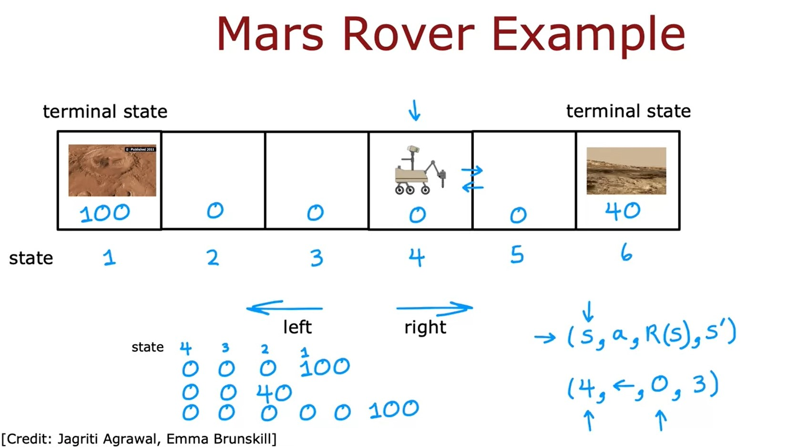

# Reinforcement learning
## Reinforcement learning introduction
### What is Reinforcement Learning?
* How do you get a helicopter to fly itself using reinforcement learning? The task is given the position of the helicopter to decide how to move the control sticks.

$$
\begin{align*}
\text{position of the helicopter} & \longrightarrow \text{how to move the control sticks} \newline
\text{state } s & \longrightarrow \text{action } a
\end{align*}
$$

* Supervised Learning is not a great approach for autonomous helicopter flying.
* A key input to a reinforcement learning is something called the reward or the **reward function** which tells the helicopter when it's doing well and when it's doing poorly.
    * **Positive reward**: helicopter flying well $\longrightarrow +1$.
    * **Negative reward**: helicopter flying poorly $\longrightarrow -1000$.
* Application:
    * Controlling robots.
    * Factory optimization.
    * Financial (stock) trading.
    * Playing games (including video games)
### Mars rover example

* We'll develop reinforcement learning using a simplified example inspired by the Mars rover.
    * In this application, the rover can be in any of six positions, as shown by the six boxes here.
    * The rover, it might start off, say, in disposition into fourth box shown above.
* The position of the Mars rover is called the **state** in reinforcement learning.
* We're going to call these six states, _state 1_, _state 2_, _state 3_, _state 4_, _state 5_, and _state 6_, and so the rover is starting off in _state 4_.
* We would more likely to carry out the science mission ant _state 1_ than at _state 6_, but _state 1_ is further away.
    * The way we will reflect _state 1_ being potentially more valuable is through the reward function. 
    * The reward at _state 1_ is a 100.
    * The reward at _state 6_ is 40.
    * The rewards at all of the other states in-between are zero.
* On each step, the rover gets to choose one of two actions. It can either go to the left or it can go to the right.
* In reinforcement learning, we sometimes state like _state 1_ or _state 6_ this a **terminal state**.
    * What that means is that, after it gets to one of these terminals states, gets a reward at that state, but then nothing happens after that.
* At every step, the robot is in some _state_ $s$, and it gets to choose an action $a$, and it also enjoys some rewards $R(s)$ that it gets from that state. As a result of this action, it to some new state $s'$.

$$
\begin{align*}
(s, a, R(s), s') \newline
(4, \leftarrow, 0, 3)
\end{align*}
$$

> **Note**:  
> The reward $R$ is associated with state $s$ not $s'$

[<<Previous](../week-02/README.md) | [Next>>](../README.md)