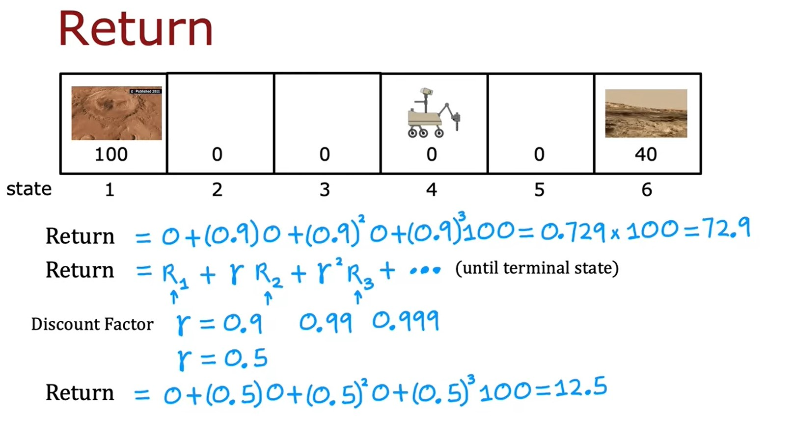
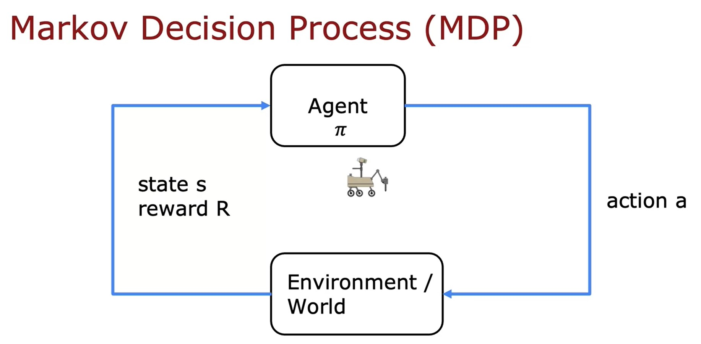
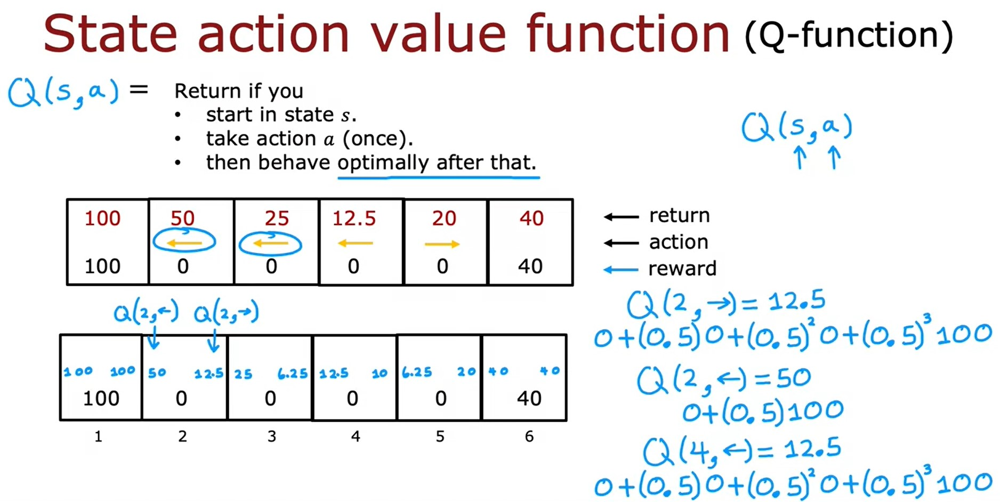
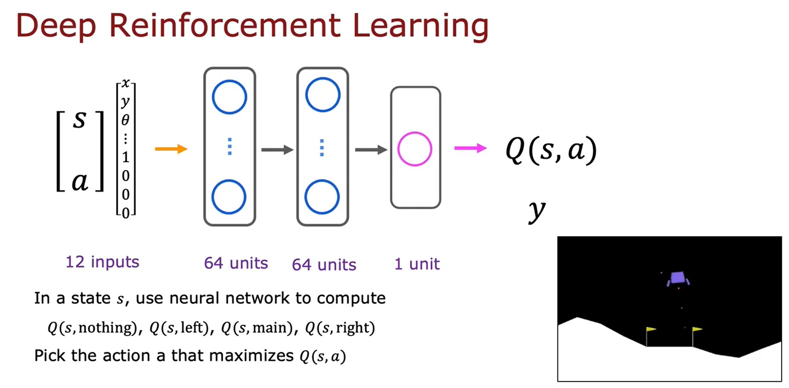
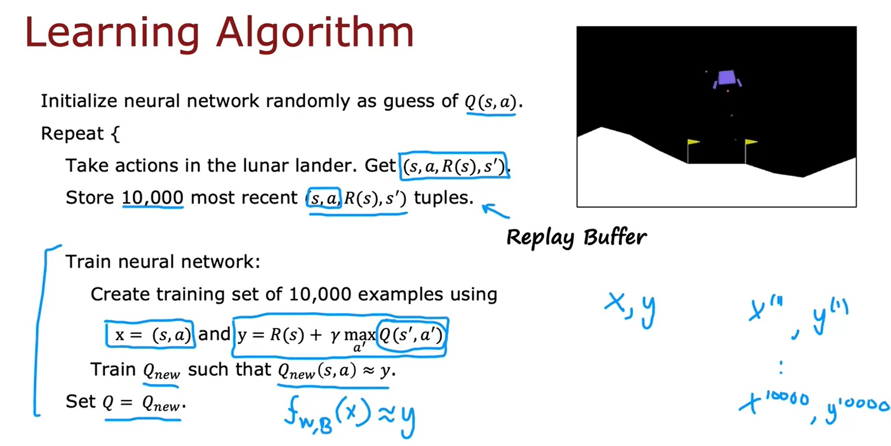
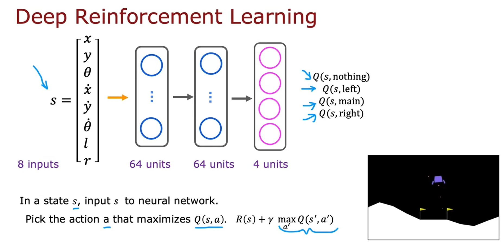

# Reinforcement learning
## Reinforcement learning introduction
### What is Reinforcement Learning?
* How do you get a helicopter to fly itself using reinforcement learning? The task is given the position of the helicopter to decide how to move the control sticks.

$$
\begin{align*}
\text{position of the helicopter} & \longrightarrow \text{how to move the control sticks} \newline
\text{state } s & \longrightarrow \text{action } a
\end{align*}
$$

* Supervised Learning is not a great approach for autonomous helicopter flying.
* A key input to a reinforcement learning is something called the reward or the **reward function** which tells the helicopter when it's doing well and when it's doing poorly.
    * **Positive reward**: helicopter flying well $\longrightarrow +1$.
    * **Negative reward**: helicopter flying poorly $\longrightarrow -1000$.
* Application:
    * Controlling robots.
    * Factory optimization.
    * Financial (stock) trading.
    * Playing games (including video games)
### Mars rover example

* We'll develop reinforcement learning using a simplified example inspired by the Mars rover.
    * In this application, the rover can be in any of six positions, as shown by the six boxes here.
    * The rover, it might start off, say, in disposition into fourth box shown above.
* The position of the Mars rover is called the **state** in reinforcement learning.
* We're going to call these six states, _state 1_, _state 2_, _state 3_, _state 4_, _state 5_, and _state 6_, and so the rover is starting off in _state 4_.
* We would more likely to carry out the science mission ant _state 1_ than at _state 6_, but _state 1_ is further away.
    * The way we will reflect _state 1_ being potentially more valuable is through the reward function. 
    * The reward at _state 1_ is a 100.
    * The reward at _state 6_ is 40.
    * The rewards at all of the other states in-between are zero.
* On each step, the rover gets to choose one of two actions. It can either go to the left or it can go to the right.
* In reinforcement learning, we sometimes state like _state 1_ or _state 6_ this a **terminal state**.
    * What that means is that, after it gets to one of these terminals states, gets a reward at that state, but then nothing happens after that.
* At every step, the robot is in some _state_ $s$, and it gets to choose an action $a$, and it also enjoys some rewards $R(s)$ that it gets from that state. As a result of this action, it to some new state $s'$.

$$
\begin{align*}
(s, a, R(s), s') \newline
(4, \leftarrow, 0, 3)
\end{align*}
$$

> **Note**:  
> The reward $R$ is associated with state $s$ not $s'$

### The Return in reinforcement learning
* How do you know if a particular set of rewards is better or worse than a different set of rewards?
* The concept of a **Return** captures that rewards you can get quicker are maybe more attractive than rewards that take you a long time to get to.

* The **Return** is defined as the sum of rewards until the _terminal state_ but weighted by one additional factor, which is called the **discount factor** $\gamma$.

$$
\text{Return} = R_{1} + \gamma R_{2} + \gamma^{2} R_{3} + \dots \text{until terminal state}
$$

* What the **discount factor** $\gamma$ does is it has the effect of making the reinforcement learning algorithm a little bit impatient so getting rewards sooner results in a higher value for the total return.
* In many reinforcement learning algorithms, a common choice for the discount factor will be a number pretty close to 1, like 0.9, or 0.99, or even 0.999.

> **Note**:  
> In financial applications, the discount factor also has a very natural interpretation as the **interest rate** or the **time value of money**.

### Making decisions: Policies in reinforcement learning
* There are different ways that you can take actions in the reinforcement learning problem:
    * We could decide to always go for the nearer reward.
    * We could choose actions is to always go for the larger reward.
    * We could always go for smaller reward.
    * We could choose to go left unless you're just one step away from the lesser reward.
* In reinforcement learning, our goal is to come up with a function which is called a **Policy** $\pi$, whose job it is to take as input any state $s$ and map it to some action $a$ that it wants us to take.

$$
\text{state} \quad s \quad \xrightarrow[\pi]{\text{policy}} \quad \text{action} \quad a
$$

> **The goal of reinforcement learning**  
Find a policy $\pi$ that tells you what action $(a=\pi(s))$ to take in every state $(s)$ so as to maximize the retun.

### Markov decision process (MDP)

* This formalism of a reinforcement learning application has a name. It's called a **Markov decision process**.
* The term _Markov_ in the MDP or Markov decision process refers to that the future only depends on the current state and not on anything that might have occurred prior to getting to the current state.
    * In other words, in a Markov decision process, the future depends only on where you are now, not on how you got here.
## State-action value function
### State-action value function definition
* The state action value function is a function typically denoted by $Q(s,a)$ will give a number = the _Return_ if you:
    * start in state $s$.
    * take action $a$ (once).
    * Then behave optimally (take actions that will result in the highest possible return) after that.

* The best possible return from state $s$ is $\max\limits_{a} Q(s,a)$.
* The best possible action in state $s$ is the action $a$ that gives $\max\limits_{a} Q(s,a)$.

### Bellman Equations
* In reinforcement learning, there's a key equation called the **Bellman equation** that will help us to compute the state action value function.
* Notation:

$$
\begin{align*}
s & \text{ : current state} \qquad R(s) = \text{reward of current state} \newline
a & \text{ : current action} \newline
s' & \text{ : state you get to after taking action } a \newline
a' & \text{ : action that you take in state } s'
\end{align*}
$$

* Bellman equation

$$
\begin{align*}
Q(s, a) & = \underbrace{R(s)}_{\text{Reward you get right away}} + \underbrace{\gamma \max\limits_{a'}{Q(s',a')}}_{\text{Return from behaving optimally starting from state } s'} \newline
& = R_{1} + \gamma R_{2} + \gamma^{2} R_{3} + \gamma^{3} R_{4} + \dots \newline
& = R_{1} + \gamma \left[R_{2} + \gamma R_{3} + \gamma^{2} R_{4} + \dots \right]
\end{align*}
$$

> **Note**  
> At terminal state $Q(s, a) = R(s)$

### Random (stochastic) environment
* In stochastic environment, when you take an action, the outcome is not always completely reliable.
    * For example, if you command your Mars rover to go left maybe there's a little bit of a rock slide, or maybe the floor is really slippery and so it slips and goes in the wrong direction.
* In a stochastic reinforcement learning problem, what we're interested in is not maximizing the return because that's a random number. What we're interested in is maximizing the average value of the sum of counted rewards.

$$
\begin{align*}
\text{Expected Return } & = \text{Average}(R_{1} + \gamma R_{2} + \gamma^{2}R_{3} + \gamma^{3}R_{4} + \dots) \newline
& = E \left[R_{1} + \gamma R_{2} + \gamma^{2}R_{3} + \gamma^{3}R_{4} + \dots \right]
\end{align*}
$$

* The job of reinforcement learning algorithm is to choose a policy $\pi(s) = a$ that will tell us what action $a$ to take in state $s$ so as to maximize the expected return.

$$
Q(s, a) = R(s) + \gamma E\left[ \max\limits_{a'}{Q(s',a')}\right]
$$

[Lab: State-action value function](./code/State-action%20value%20function%20example.ipynb)

## Continuous state spaces
### Example of continuous state space applications
* In example of self driving truck, the state will include 6 numbers:

$$
s = \begin{bmatrix} x \newline y \newline \theta \newline \dot{x} \newline \dot{y} \newline \dot{\theta} \end{bmatrix}
$$

* The state of the problem of continuous state reinforcement learning problem or a continuous state Markov decision process isn't just one of a small number of possible discrete values, like a number from 1-6. Instead, it's a vector of numbers, any of which could take any of a large number of values.
### Deep Reinforcement Learning

* The heart of the learning algorithm is we're going to train a neural network that inputs the current state and the current action and computes or approximates $Q(s, a)$.
* what we're going to do is not input a state and have it output an action. What we're going to do is input a state action pair and have it try to output $Q(s, a)$.
* We use [Bellman's equations](#bellman-equations) to create a training set with lots of examples, $x$ and $y$, and then we'll use supervised learning exactly as you learned in the second course when we talked about neural networks.

$$
Q(\underbrace{s,a}_{\mathbf{x}}) = \underbrace{R(s) + \gamma \max\limits_{a'}{Q(s',a')}}_{\mathbf{y}}
$$

* By just trying out different things in the lunar lander simulator we'll observe a lot of examples of when we're in some state and we took some action, may be a good action, maybe a terrible action either way. 
* Then we got some reward $R(s)$ for being in that state, and as a result of our action, we got to some new state, $s'$.
#### Learning Algorithm

### Algorithm refinement: Improved neural network architecture

[<<Previous](../week-02/README.md) | [Next>>](../README.md)